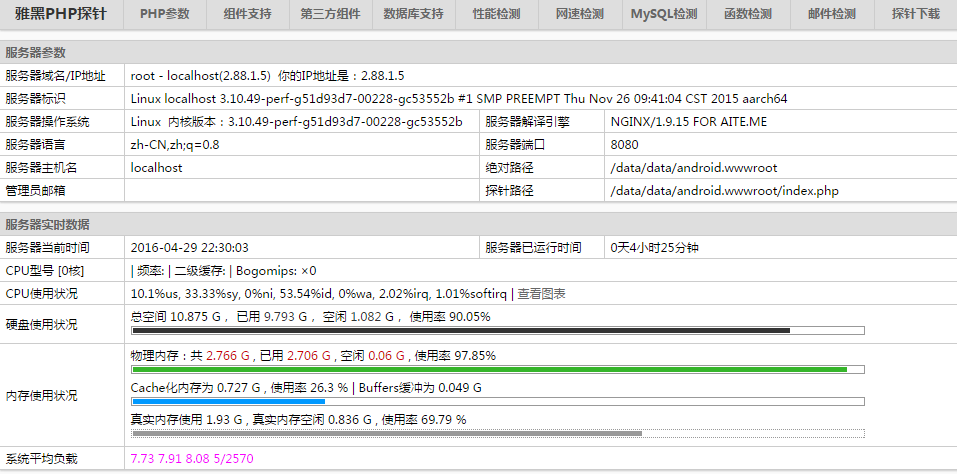
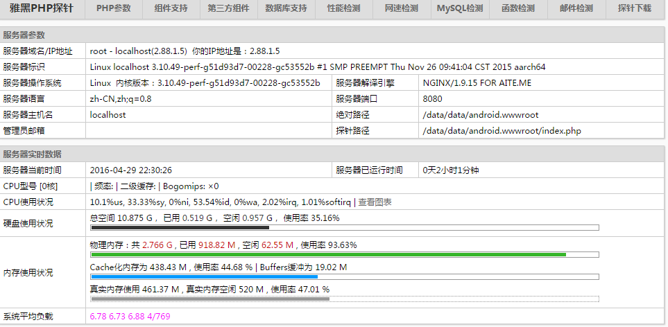

昨晚研究了一晚，现在用一个效率更高的方案：直接在安卓系统上运行而不chroot到linux镜像下。

安卓已经有人做好一个集成环境了：[android nginx mysql pgsql php-fpm download | SourceForge.net](https://sourceforge.net/projects/anmpp/)

论坛链接：http://webthen.net/forum-36-1.html

你需要下载一个apk和一个zip。apk用于控制，zip里面包含了 nginx mysql pgsql php 的二进制文件和配置文件。如果apk里面有一键安装，如果不行就打开anmpp.sh，自己看着办。

环境搭建完成之后，我们打开bftpd、nginx、php-fpm这三个，然后启动环境。

浏览器输入172.0.0.1，看到phpinfo了，说明成功运行。

bftpd用户名密码都是root，开bftpd是为了方便传文件。（早期的anmpp是没有这个的）

---

环境搭建好了，一切都好办！你能感受到linux的强大之处吗？安卓基于linux，安卓也可以做集群！

测试设备两台：U960s3、NX510J
- U960s3的IP：2.88.1.4
- NX510J的IP：2.88.1.5

参考昨天的研究，现在打开ftp://2.88.1.5，登录，进入ftp://2.88.1.5/data/data/android.nginx/conf/，下载nginx.conf这个文件进行修改。修改后上传，覆盖原来的那个。

原始文件：

```nginx
​
user  root;

worker_processes  2;

#error_log  logs/error.log;

#error_log  logs/error.log  notice;

#error_log  logs/error.log  info;

#pid        logs/nginx.pid;

events {

    worker_connections  1024;

}

http {

    include       mime.types;

    default_type  application/octet-stream;

    #log_format  main  '$remote_addr - $remote_user [$time_local] "$request" '

    #                  '$status $body_bytes_sent "$http_referer" '

    #                  '"$http_user_agent" "$http_x_forwarded_for"';

    #access_log  logs/access.log  main;

    sendfile        on;

    #tcp_nopush     on;

    #keepalive_timeout  0;

    keepalive_timeout  65;

    #gzip  on;

    server {

        listen      80 default;

        server_name  localhost;

        autoindex            on;

        autoindex_exact_size on;

        root    /data/data/android.wwwroot;

        index   index.html index.htm index.php;

        #charset koi8-r;

        #access_log  logs/host.access.log  main;

        #error_page  404              /404.html;

        # redirect server error pages to the static page /50x.html

        #

        error_page   500 502 503 504  /50x.html;

        location = /50x.html {

            root   html;

        }

        # proxy the PHP scripts to Apache listening on 127.0.0.1:80

        #

        #location ~ \.php$ {

        #    proxy_pass   http://127.0.0.1;

        #}

        # pass the PHP scripts to FastCGI server listening on 127.0.0.1:9000

        #

        location ~* \.php$ {

            fastcgi_index  index.php;

            client_max_body_size 64m;

            fastcgi_pass   unix:/data/data/android.php-fpm/tmp/php-fpm.socket;

            fastcgi_param  SCRIPT_FILENAME  /data/data/android.wwwroot$fastcgi_script_name;

            include        fastcgi_params;

        }

        # deny access to .htaccess files, if Apache's document root

        # concurs with nginx's one

        #

        #location ~ /\.ht {

        #    deny  all;

        #}

    }

    # another virtual host using mix of IP-, name-, and port-based configuration

    #

    #server {

    #    listen       8000  default;

    #    listen       somename:8080;

    #    server_name  somename  alias  another.alias;

    #    location / {

    #        root   html;

    #        index  index.html index.htm;

    #    }

    #}

    # HTTPS server

    #

    #server {

    #    listen     443 default;

    #    server_name  localhost;

    #    ssl                  on;

    #    ssl_certificate      cert.pem;

    #    ssl_certificate_key  cert.key;

    #    ssl_session_timeout  5m;

    #    ssl_protocols  SSLv2 SSLv3 TLSv1;

    #    ssl_ciphers  HIGH:!aNULL:!MD5;

    #    ssl_prefer_server_ciphers   on;

    #    location / {

    #        root   html;

    #        index  index.html index.htm;

    #    }

    #}

} 

​
```

修改后文件：

```nginx
​
user  root;

worker_processes  2;

#error_log  logs/error.log;

#error_log  logs/error.log  notice;

#error_log  logs/error.log  info;

#pid        logs/nginx.pid;

events {

    worker_connections  1024;

}

http {

    include       mime.types;

    default_type  application/octet-stream;

    #log_format  main  '$remote_addr - $remote_user [$time_local] "$request" '

    #                  '$status $body_bytes_sent "$http_referer" '

    #                  '"$http_user_agent" "$http_x_forwarded_for"';

    #access_log  logs/access.log  main;

    sendfile        on;

    #tcp_nopush     on;

    #keepalive_timeout  0;

    keepalive_timeout  65;

    #gzip  on;

    server {

        listen      80 default;

        server_name  localhost;

        autoindex            on;

        autoindex_exact_size on;

        root    /data/data/android.wwwroot;

        index   index.html index.htm index.php;

        location / {

            proxy_pass http://site;

        }

        #charset koi8-r;

        #access_log  logs/host.access.log  main;

        #error_page  404              /404.html;

        # redirect server error pages to the static page /50x.html

        #

        error_page   500 502 503 504  /50x.html;

        location = /50x.html {

            root   html;

        }

        # proxy the PHP scripts to Apache listening on 127.0.0.1:80

        #

        #location ~ \.php$ {

        #    proxy_pass http://site;

        #}

        # deny access to .htaccess files, if Apache's document root

        # concurs with nginx's one

        #

        #location ~ /\.ht {

        #    deny  all;

        #}

    }

    # another virtual host using mix of IP-, name-, and port-based configuration

    #

    server {

        listen       8080  default;

        server_name  localhost;

        autoindex            on;

        autoindex_exact_size on;

        root    /data/data/android.wwwroot;

        index   index.html index.htm index.php;

        #charset koi8-r;

        #access_log  logs/host.access.log  main;

        #error_page  404              /404.html;

        # redirect server error pages to the static page /50x.html

        #

        error_page   500 502 503 504  /50x.html;

        location = /50x.html {

            root   html;

        }

        location ~* \.php$ {

            fastcgi_index  index.php;

            client_max_body_size 64m;

            fastcgi_pass   unix:/data/data/android.php-fpm/tmp/php-fpm.socket;

            fastcgi_param  SCRIPT_FILENAME  /data/data/android.wwwroot$fastcgi_script_name;

            include        fastcgi_params;

        }

    }

    upstream site {

        server 2.88.1.5:8080;

        server 2.88.1.4:80;

    }

    # HTTPS server

    #

    #server {

    #    listen     443 default;

    #    server_name  localhost;

    #    ssl                  on;

    #    ssl_certificate      cert.pem;

    #    ssl_certificate_key  cert.key;

    #    ssl_session_timeout  5m;

    #    ssl_protocols  SSLv2 SSLv3 TLSv1;

    #    ssl_ciphers  HIGH:!aNULL:!MD5;

    #    ssl_prefer_server_ciphers   on;

    #    location / {

    #        root   html;

    #        index  index.html index.htm;

    #    }

    #}

} 

​
```

---

进入 ftp://2.88.1.5/data/data/android.wwwroot/ 和 ftp://2.88.1.4/data/data/android.wwwroot/

分别放入一个同名但内容不同的html文件，然后重启2.88.1.5的nginx，以读取最新的配置文件。

浏览器打开2.88.1.5，不断刷新，发现页面不断地换，负载均衡集群搭建成功！

这个只是一个雏形，nginx的负载均衡的配置还能更复杂一点，例如让一个用户保持访问同一台服务器，以保持数据一致。如果不这样做，放个雅黑PHP探针上去看看，会发现下面的资源监控是不断在两台服务器之间切换的。

看看探针的图，会不断地跳。





linux的强大，你感受到了吗？