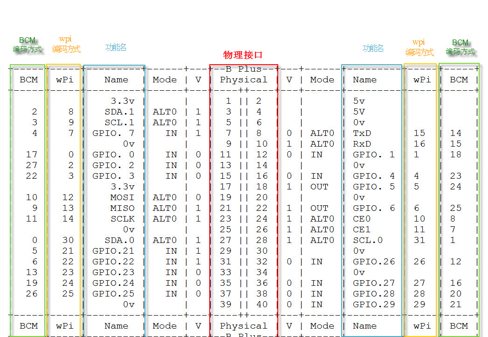
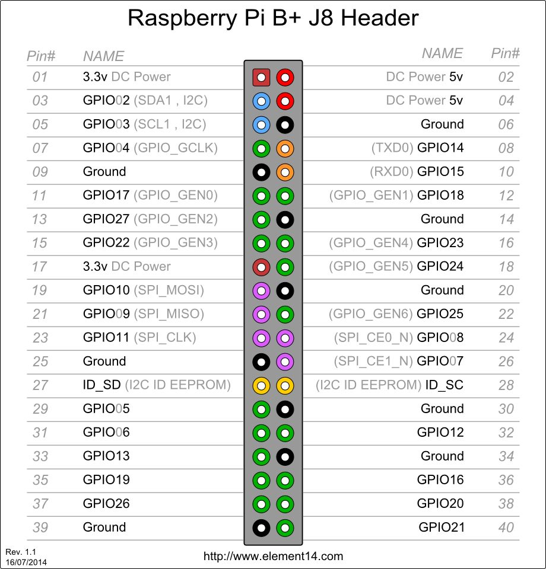

## Part 1

### 树莓派GPIO编号方式和引脚说明

参考：[ 树莓派开发系列教程9——树莓派GPIO控制](http://blog.csdn.net/xdw1985829/article/details/39580401/)

1、功能物理引脚  
从左到右，从上到下，左边基数，右边偶数，1-40。

2、BCM  
编号侧重CPU寄存器，根据BCM2835的GPIO寄存器编号。

3、wpi  
编号侧重实现逻辑，把扩展GPIO端口从0开始编号，这种编号方便编程。





### RPi.GPIO

官方页面：[pypi.python.org](https://pypi.python.org/pypi/RPi.GPIO)

SF页面：[raspberry-gpio-python](https://sourceforge.net/p/raspberry-gpio-python/wiki/Home/)

中文简单的示例代码可参考：[Python GPIO实现](http://blog.csdn.net/xukai871105/article/details/12684617#t3)

**RPi.GPIO使用的是第一种方法编号的引脚。**

能用Python写的就不用C写，因为python实在太方便了。

关于传感器怎么连接树莓派的问题，Vcc连树莓派的3.3V或5V，GND连树莓派的Ground，DATA或者OUT或者别的数据引脚就连树莓派随便一个能用的GPIO口。

## Part 2

### DHT11温湿度传感器

要使用它，首先需要看DHT11的文档。

[DHT11中文说明书](http://wenku.baidu.com/link?url=TCTUjZH1BjxjaBC1D-R2_M3DBIMCobdojAzc-8wrisn7A_oKkBVJRTBQxtClI4Q1elePFf_PKU2ZWg7SJTj8mfu3JcKtaaM7GFMx7eJYH_K)

知道怎么用之后，我们需要用一些简单的语句来制造延时，例如：i=1、k+=1 等等。每一句的延时和树莓派CPU及其频率有关，因此使用前要测试一下。

**PS：其实这个传感器精度很低。**

#### 测试延时的代码

通过下面的代码我们能测出这两个语句的延时，同时也看出来time.sleep在这么短的时间内是很不准的。

```python
import time

a=time.time()
i=1
c=time.time()
d=c-a
print "i=1这条语句的延时为：",d  # 4-7μs
k=0
a=time.time()
k+=1
c=time.time()
d=c-a
print "k+=1这条语句的延时为：",d  # 4-7μs
a=time.time()
time.sleep(0.000001)  # =1μs
c=time.time()
d=c-a
print "time.sleep(0.000001)这条语句的延时为：",d  # 200-234μs
```

#### DHT11示例代码

这个我不记得在哪里找到的了。注意GPIO口要对应。

```python
# -*- coding: utf-8 -*-
"""
Created on Sun Jan 26 16:01:59 2014
 
@author: pi
"""

import RPi.GPIO as gpio
gpio.setwarnings(False)
gpio.setmode(gpio.BOARD)
retry_times=0
def getdata():
    global retry_times
    data=[]
    j=0
    time.sleep(1)
    #start work
    gpio_number=7
    gpio.setup(gpio_number,gpio.OUT)
    gpio.output(gpio_number,gpio.LOW)  #  18ms
    time.sleep(0.1) 
    gpio.output(gpio_number,gpio.HIGH)  # 20-40μs
    i=1
    i=1
    i=1
    i=1
      
    #wait to response
    gpio.setup(gpio_number,gpio.IN)
    while gpio.input(gpio_number)==1:
        continue
    while gpio.input(gpio_number)==0:  # 40-50μs
        continue
    while gpio.input(gpio_number)==1:  # 40-50μs
        continue
    
    #get data
    while j<40:
        k=0
        while gpio.input(gpio_number)==0:
            continue
        while gpio.input(gpio_number)==1:
            k+=1
            if k>20:break
        if k<15:
            data.append(0)  # 26-28μs
        else:
            data.append(1)  # 116-118μs
        j+=1
    
    #get temperature
    humidity_bit=data[0:8]
    humidity_point_bit=data[8:16]
    temperature_bit=data[16:24]
    temperature_point_bit=data[24:32]
    check_bit=data[32:40]
    
    humidity=0
    humidity_point=0
    temperature=0
    temperature_point=0
    check=0
    
    for i in range(8):
        humidity+=humidity_bit[i]*2**(7-i)
        humidity_point+=humidity_point_bit[i]*2**(7-i)
        temperature+=temperature_bit[i]*2**(7-i)
        temperature_point+=temperature_point_bit[i]*2**(7-i)
        check+=check_bit[i]*2**(7-i)
     
    tmp=humidity+humidity_point+temperature+temperature_point
    if check==tmp:
        print "temperature is ", temperature,"   wet is ",humidity,"%"
        return 0
    else:
        print "something is worong the humidity,humidity_point,temperature,temperature_point,check is",humidity,humidity_point,temperature,temperature_point,check
        if retry_times==5:
            print 'error'
            return 1
        retry_times+=1
        getdata()
        
getdata()
```

#### DHT11与Yeelink结合使用

下面这个是我自己用的代码，功能是获取DHT11传感器的数据并上传到Yeelink。注意GPIO口要对应。

我收集的数据：[CHN-Lee-Yumi的树莓派](http://www.yeelink.net/devices/340670)

```python
# encoding: utf-8
import os
import requests
import time
import json
import RPi.GPIO as gpio
gpio.setwarnings(False)
gpio.setmode(gpio.BOARD)

#settings:
apikey='这里是你的Yeelink的key'
    

def dht11getdata(gpio_number):
    retry_times=0
    while retry_times<=5:
        data=[]
        j=0
        time.sleep(1)
        #start work
        gpio.setup(gpio_number,gpio.OUT)
        gpio.output(gpio_number,gpio.LOW)  #  >18ms
        time.sleep(0.1) 
        gpio.output(gpio_number,gpio.HIGH)  # 20-40μs
        i=1
        i=1
        i=1
        #i=1
        
        #wait to response
        gpio.setup(gpio_number,gpio.IN)
        k=0
        while gpio.input(gpio_number)==1:
            #continue
            k+=1
            if k==20:break
        k=0 
        while gpio.input(gpio_number)==0:  # 40-50μs
            #continue
            k+=1
            if k==20:break
        k=0
        while gpio.input(gpio_number)==1:  # 40-50μs
            #continue
            k+=1
            if k==20:break
        
        #get data
        while j<40:
            k=0
            while gpio.input(gpio_number)==0:
                #continue
                k+=1
                if k==20:break
            k=0
            while gpio.input(gpio_number)==1:
                k+=1
                if k==30:break
            if k<10:
                data.append(0)  # 26-28μs
            else:
                data.append(1)  # 116-118μs
                #while gpio.input(gpio_number)==1:
                #    continue
            j+=1
        
        #get temperature
        humidity_bit=data[0:8]
        humidity_point_bit=data[8:16]
        temperature_bit=data[16:24]
        temperature_point_bit=data[24:32]
        check_bit=data[32:40]
        
        humidity=0
        humidity_point=0
        temperature=0
        temperature_point=0
        check=0
        
        for i in range(8):
            humidity+=humidity_bit[i]*2**(7-i)
            humidity_point+=humidity_point_bit[i]*2**(7-i)
            temperature+=temperature_bit[i]*2**(7-i)
            temperature_point+=temperature_point_bit[i]*2**(7-i)
            check+=check_bit[i]*2**(7-i)
         
        tmp=humidity+humidity_point+temperature+temperature_point
        #print str(temperature)+','+str(humidity)
        if check==tmp and temperature!=0 and humidity!=0:
            #print str(temperature)+','+str(humidity)
            return str(temperature)+','+str(humidity)
        else:
            retry_times+=1
            
    
def uploaddata():
    is_correct=False
    while is_correct==False:
        timestamp=time.strftime("%Y-%m-%dT%H:%M:%S")
        dht11=dht11getdata(5)
        print 'dht11:',dht11
        # 新数据
        dht11_temperature=dht11.split(',')[0]
        dht11_humidity=dht11.split(',')[1]
        # 旧数据
        dht11_temperature_old=json.loads(requests.get("http://api.yeelink.net/v1.0/device/340670/sensor/393447/datapoints").text)["value"]
        dht11_humidity_old=json.loads(requests.get("http://api.yeelink.net/v1.0/device/340670/sensor/393448/datapoints").text)["value"]
        # 与旧数据比较
        is_correct=(abs(int(dht11_temperature)-int(dht11_temperature_old))<=2 and abs(int(dht11_humidity)-int(dht11_humidity_old))<=6)
    
    json_temperature='{"timestamp":"'+timestamp+'","value":'+dht11_temperature+'}'
    print json_temperature
    print requests.post("http://api.yeelink.net/v1.0/device/340670/sensor/393447/datapoints",data=json_temperature,headers={'U-ApiKey': apikey})
    
    json_humidity='{"timestamp":"'+timestamp+'","value":'+dht11_humidity+'}'
    print json_humidity
    print requests.post("http://api.yeelink.net/v1.0/device/340670/sensor/393448/datapoints",data=json_humidity,headers={'U-ApiKey': apikey})

    
if __name__ == '__main__':
    try:
        uploaddata()
    except:
        pass
```

### HC-SR501人体红外感应模块

按照惯例，应该先阅读文档。

[HC-SR501人体红外感应模块说明书](http://wenku.baidu.com/link?url=voT3LvZEGVQG3LS2ZonaeULItwRrgd1decMNelgFahWz2r3xj1M6kgca6wqTTubvDrKcBI-onqDQIc7t_tFLeIDF2r7JZGSxeZ4vszxMqhG)

简单地说就是有人就输出高电平，没人就输出低电平。

这个代码就超级好写了。

#### 思路

1.循环检测输出电平。
2.如果是高电平，发送有人的消息。

#### 示例代码

我自己写的。注意针脚不要接错。使用5V供电，正负极不要接反了。

```python
# encoding: utf-8
import RPi.GPIO as gpio
import time

gpio.setwarnings(False)
gpio.setmode(gpio.BOARD)

gpio_number=8
gpio.setup(gpio_number,gpio.IN)

while 1:
    if gpio.input(gpio_number)==1:
        print("+++++++++++++++++")
    else:
        print("------")
    time.sleep(0.1)
```

### HC-SR04超声波测距模块

按照惯例，应该先阅读文档。

[HC-SR04超声波测距模块说明书](http://wenku.baidu.com/link?url=jpCRkaNKQ9v-rYwmKXlaJwvKBpLj0dvw8tN9ovUp_sVwZ6k97uKLY_BN4oE0P40ifauzSO7qmGlSVl0WVEp1wh6f55T5S5MwHLYhqQJ3hn3)

参考：[HC-SR04超声波测距模块简易教程](http://bbs.elecfans.com/forum.php?mod=viewthread&tid=451330)

**PS：实测测量距离是0.04-30m。如果长时间收不到信号就会输出30m。**

#### 思路

1.给控制脚一个长于10μs的高电平。
2.监测输出脚的电平，发现由低电平变成高电平就记录一次时间。
3.监测输出脚的电平，发现由高电平变成低电平再记录一次时间。
4.根据时间差和声速计算出距离。

#### 示例代码

我自己写的。使用5V供电。注意针脚不要接错。

```python
# encoding: utf-8
import RPi.GPIO as gpio
import time

gpio.setwarnings(False)
gpio.setmode(gpio.BOARD)

gpio_trig=10
gpio_echo=12
gpio.setup(gpio_trig,gpio.OUT)
gpio.output(gpio_trig,gpio.LOW)
gpio.setup(gpio_echo,gpio.IN)

for times in range(1,6): # 重复测5次
    gpio.output(gpio_trig,gpio.HIGH) # 需要10μs以上
    i=1
    i=1
    i=1
    gpio.output(gpio_trig,gpio.LOW)
    while gpio.input(gpio_echo)==0:
        continue
    t1=time.time()
    while gpio.input(gpio_echo)==1:
        continue
    t2=time.time()
    distance=(t2-t1)*340/2
    print(distance)
    time.sleep(0.1)
```