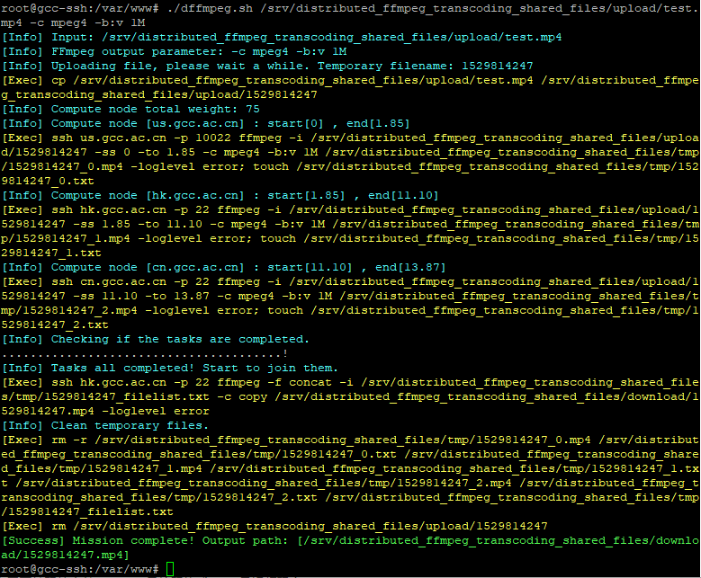

代码已上传到GitHub。项目链接： https://github.com/chn-lee-yumi/distributed_ffmpeg_transcoding_cluster

## 思路

- 分布式转码集群
- 暂时的目标: FFMPEG实现任意格式转MP4。
- 1控制节点，3计算节点。
- 存储暂时采用单节点的共享存储(NFS)，可尝试分布式存储。
- 所有节点对CPU架构无要求，暂时用x86进行测试，后期加入ARM架构。
- 控制节点和计算节点通信暂时使用SSH。
- 思路: 控制节点收到请求，将文件传到共享存储，计算视频总帧数，然后发送命令给计算节点，不同节点按照各自权重(手动设置，可加性能测试功能)处理一定的连续帧，输出到共享存储，全部节点转码完毕后交由存储节点进行合并，并清理共享临时文件，最后控制节点返回转码后的视频链接。

## 安装与配置

- 测试组网：三台公网VPS cn.gcc.ac.cn, hk.gcc.ac.cn, us.gcc.ac.cn
- 存储节点：hk.gcc.ac.cn
- 控制节点：cn.gcc.ac.cn
- 计算节点：cn.gcc.ac.cn,hk.gcc.ac.cn,us.gcc.ac.cn

### 存储节点

- 存储节点系统是Debian

```shell
# 安装NFS
apt-get install nfs-kernel-server
# 新建共享文件夹，用于放渲染前上传的文件、渲染后的分片文件、渲染后的完整文件。
mkdir -p /srv/distributed_ffmpeg_transcoding_shared_files
mkdir /srv/distributed_ffmpeg_transcoding_shared_files/upload
mkdir /srv/distributed_ffmpeg_transcoding_shared_files/tmp
mkdir /srv/distributed_ffmpeg_transcoding_shared_files/download
chmod -R 777 /srv/distributed_ffmpeg_transcoding_shared_files
```

- 修改文件`/etc/exports`，将目录共享出去
- upload目录，控制节点有读写权限，计算节点有只读权限
- tmp，计算节点有读写权限
- download目录，存储计算节点有读写权限（由于这里只有单节点存储，就不需要共享了）

```shell
# /etc/exports: the access control list for filesystems which may be exported
#               to NFS clients.  See exports(5).
#
# Example for NFSv2 and NFSv3:
# /srv/homes       hostname1(rw,sync,no_subtree_check) hostname2(ro,sync,no_subtree_check)
#
# Example for NFSv4:
# /srv/nfs4        gss/krb5i(rw,sync,fsid=0,crossmnt,no_subtree_check)
# /srv/nfs4/homes  gss/krb5i(rw,sync,no_subtree_check)
#
/srv/distributed_ffmpeg_transcoding_shared_files/upload cn.gcc.ac.cn(ro,insecure) us.gcc.ac.cn(ro,insecure)
/srv/distributed_ffmpeg_transcoding_shared_files/tmp cn.gcc.ac.cn(rw,insecure) us.gcc.ac.cn(rw,insecure)
```

- **注：特别注意要用insecure，否则会挂载不上，显示access denied。这个坑了我好久。**
- 修改完后用`exportfs -arv`生效。可以使用`showmount -e`查看。

### 计算节点

```shell
# 新建目录
mkdir -p /srv/distributed_ffmpeg_transcoding_shared_files/upload
mkdir -p /srv/distributed_ffmpeg_transcoding_shared_files/tmp
# 挂载NFS，这里只是临时挂载，可以修改fstab或开机启动脚本进行自动挂载
mount hk.gcc.ac.cn:/srv/distributed_ffmpeg_transcoding_shared_files/upload /srv/distributed_ffmpeg_transcoding_shared_files/upload
mount hk.gcc.ac.cn:/srv/distributed_ffmpeg_transcoding_shared_files/tmp /srv/distributed_ffmpeg_transcoding_shared_files/tmp
# 安装ffmpeg
apt-get install ffmpeg
```

- 注：现在jessie要在`source.list`添加`deb http://ftp.debian.org/debian jessie-backports main`才能找到这个包。

### 控制节点

```shell
# 生成ssh公钥并拷贝到计算节点
ssh-keygen -t rsa
ssh-copy-id -i ~/.ssh/id_rsa.pub hk.gcc.ac.cn # 拷贝公钥到计算节点
ssh-copy-id -i ~/.ssh/id_rsa.pub us.gcc.ac.cn -p 10022 # 拷贝公钥到计算节点，这个节点的ssh端口是10022
# 创建并挂载upload目录
mkdir -p /srv/distributed_ffmpeg_transcoding_shared_files/upload
mount hk.gcc.ac.cn:/srv/distributed_ffmpeg_transcoding_shared_files/upload /srv/distributed_ffmpeg_transcoding_shared_files/upload
```

保存下面这个脚本并加执行权限，名字随意，我保存为dffmpeg.sh。

```shell
#!/bin/bash

# 分布式FFMPEG转码 v1.2
# 支持任意格式视频转成MP4
# Usage：dffmpeg.sh [input_file] [ffmpeg_output_parameter]
# Usage：dffmpeg.sh test.mp4
# Usage：dffmpeg.sh test.mp4 -c mpeg4
# Usage：dffmpeg.sh test.mp4 -c mpeg4 -b:v 1M
# TODO：?

###配置项
storage_node="hk.gcc.ac.cn"
storage_node_ssh_port=22
compute_node=("us.gcc.ac.cn" "hk.gcc.ac.cn" "cn.gcc.ac.cn") # 计算节点
compute_node_ssh_port=(10022 22 22) # 计算节点的ssh端口
compute_node_weight=(10 50 15) # 计算节点的权重
nfs_path=/srv/distributed_ffmpeg_transcoding_shared_files #共享目录
###配置项结束

upload_path=$nfs_path/upload
tmp_path=$nfs_path/tmp
download_path=$nfs_path/download
input_file=$1
ffmpeg_output_parameter=${@:2}

# display函数，输出彩色
ECHO=`which echo`
display(){
    local type=$1
    local msg=${@:2}
    if [[ $type = "[Info]" ]]; then
        $ECHO -e "\\033[1;36;40m[Info] $msg \\033[0m"
    elif [[ $type = "[Error]" ]]; then
        $ECHO -e "\\033[1;31;40m[Error] $msg \\033[0m"
    elif [[ $type = "[Exec]" ]]; then
        $ECHO -e "\\033[1;33;40m[Exec] $msg \\033[0m"
    elif [[ $type = "[Success]" ]]; then
        $ECHO -e "\\033[1;32;40m[Success] $msg \\033[0m"
    else
        $ECHO -e $@
    fi
}

### 开始函数重载
# 重载cp，记录log
CP=`which cp`
cp(){
    local src=$1
    local dst=$2
    display [Exec] cp ${@:1}
    $CP ${@:1}
}
# 重载rm，记录log
RM=`which rm`
rm(){
    display [Exec] rm ${@:1}
    $RM ${@:1}
}
# 重载ssh，记录log
SSH=`which ssh`
ssh(){
    display [Exec] ssh ${@:1}
    $SSH ${@:1}
}
### 函数重载完毕

# 检查输入文件
if [ -f $input_file ]
then
   display [Info] Input: $input_file
   display [Info] FFmpeg output parameter: $ffmpeg_output_parameter
   filename=$(date +%s) # 用时间戳做文件名
   display [Info] Uploading file, please wait a while. Temporary filename: $filename
   cp $input_file $upload_path/$filename
else
   display [Error] Input error!
   exit
fi

# 计算计算节点总权重
total_weight=0
for i in ${compute_node_weight[*]}
do
    total_weight=$[$total_weight + $i]
done
display [Info] Compute node total weight: $total_weight

# 分发任务
video_length=$(ffprobe -show_format $input_file -loglevel error| grep duration | awk -F = '{printf $2}')
part_start=0
part_end=0
node_number=${#compute_node[*]}
# for i in {0..${#compute_node[*]}} # 不知为啥不能这样写
for ((i=0; i<$node_number; i++))
do
    # echo ${compute_node[$i]},${compute_node_weight[$i]} # 显示计算节点及其权重
    part_end=$(echo "scale=2; $part_start + $video_length * ${compute_node_weight[$i]} / $total_weight" | bc )
    display [Info] Compute node ["${compute_node[$i]}"] : start[$part_start] , end[$part_end]
    # ssh ${compute_node[$i]} -p ${compute_node_ssh_port[$i]} "ffmpeg -ss $part_start -i $upload_path/$filename -to $part_end $ffmpeg_output_parameter $tmp_path/${filename}_$i.mp4 -loglevel error; touch $tmp_path/${filename}_$i.txt" & # -ss在前面，The input will be parsed using keyframes, which is very fast. 但可能会造成视频部分片段重复。
    ssh ${compute_node[$i]} -p ${compute_node_ssh_port[$i]} "ffmpeg -i $upload_path/$filename -ss $part_start -to $part_end $ffmpeg_output_parameter $tmp_path/${filename}_$i.mp4 -loglevel error; touch $tmp_path/${filename}_$i.txt" & # -ss在后面，速度会变慢，但是不会造成视频片段重复
    part_start=$part_end
    echo "file '${filename}_$i.mp4'" >> $tmp_path/${filename}_filelist.txt
done 

# 不断检查任务是否完成
display [Info] Checking if the tasks are completed.
while :
do
    for ((i=0; i<$node_number; i++))
    do
        if [ -f $tmp_path/${filename}_$i.txt ]
        then
            if [ $i==$[$node_number - 1] ] # 如果全部完成了
            then
                break 2
            else
                continue
            fi
        else
            break
        fi
    done
    sleep 1
    display ".\c"
done
display !

# 进行视频拼接
display [Info] Tasks all completed! Start to join them.
ssh $storage_node -p $storage_node_ssh_port "ffmpeg -f concat -i $tmp_path/${filename}_filelist.txt -c copy $download_path/$filename.mp4 -loglevel error"

#清除临时文件和上传的文件
display [Info] Clean temporary files.
rm -r $tmp_path/${filename}*
rm $upload_path/${filename}

display [Success] Mission complete! Output path: [$download_path/$filename.mp4]


# ffmpeg常用命令。参考 https://www.cnblogs.com/frost-yen/p/5848781.html

#ffprobe -v error -count_frames -select_streams v:0  -show_entries stream=nb_read_frames -of default=nokey=1:noprint_wrappers=1 test.mp4 # 计算帧数量，参考 https://stackoverflow.com/questions/2017843/fetch-frame-count-with-ffmpeg

# 截取视频，参考 https://trac.ffmpeg.org/wiki/Seeking
#ffmpeg -ss 00:01:00 -i test.mp4 -to 00:02:00 -c copy cut.mp4
#ffmpeg -ss 1 -i test.mp4 -to 2 -c copy cut.mp4
#ffmpeg -ss 1 -i test.mp4 -t 1 -c copy -copyts cut.mp4
# 获取视频长度
#ffprobe -show_format test_video.mp4 | grep duration | awk -F = '{printf $2}' > /tmp/1.txt

# 合并视频 https://blog.csdn.net/doublefi123/article/details/47276739
```

## 使用方法和测试

- 在控制节点运行：`dffmpeg.sh test.mp4 -c mpeg4 -b:v 1M`
- 其中test.mp4为需要转码的文件，mpeg4是编码格式，1M是视频码率。
- 最后会输出一个mp4文件在download目录。
- 由于我的三个服务器分布在公网不同地域，瓶颈在NFS的读写速度，所以最终转码速度会比较慢。如果服务器先缓存了要转码的文件，那么最终转码速度是比一台服务器转码快的。
- 代码运行效果如下图



## 结束语

- 觉得这个好玩，所以我就写了。本来是打算用几个树莓派做测试的，不过树莓派现在只有一个，先用VPS测试一下。
- 脚本中有一段注释了的代码`for i in {0..${#compute_node[*]}}`，这是我一开始的写法，但是发现不能用。我不知道为什么不能那样写，所以写成`for ((i=0; i<$node_number; i++))`。如果知道答案的还请指点一下。
- 我觉得`不断检查任务是否完成`那部分的判断代码不大好看，不知道有没有更简洁的方法。

## 更新日志

 - v1.1：修复问题：最后的视频长度会比原来长。原因在于`-ss`参数的位置，详见代码注释。
 - v1.2：新增内容：支持FFmpeg输出参数。输出彩色详细信息。