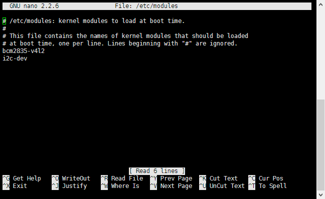
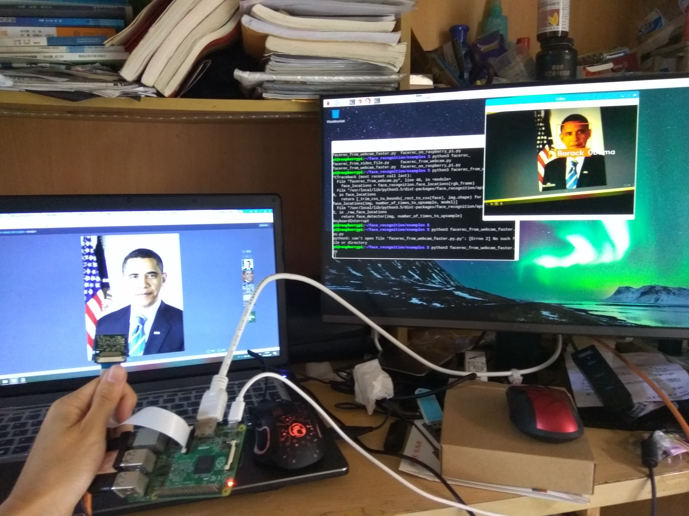
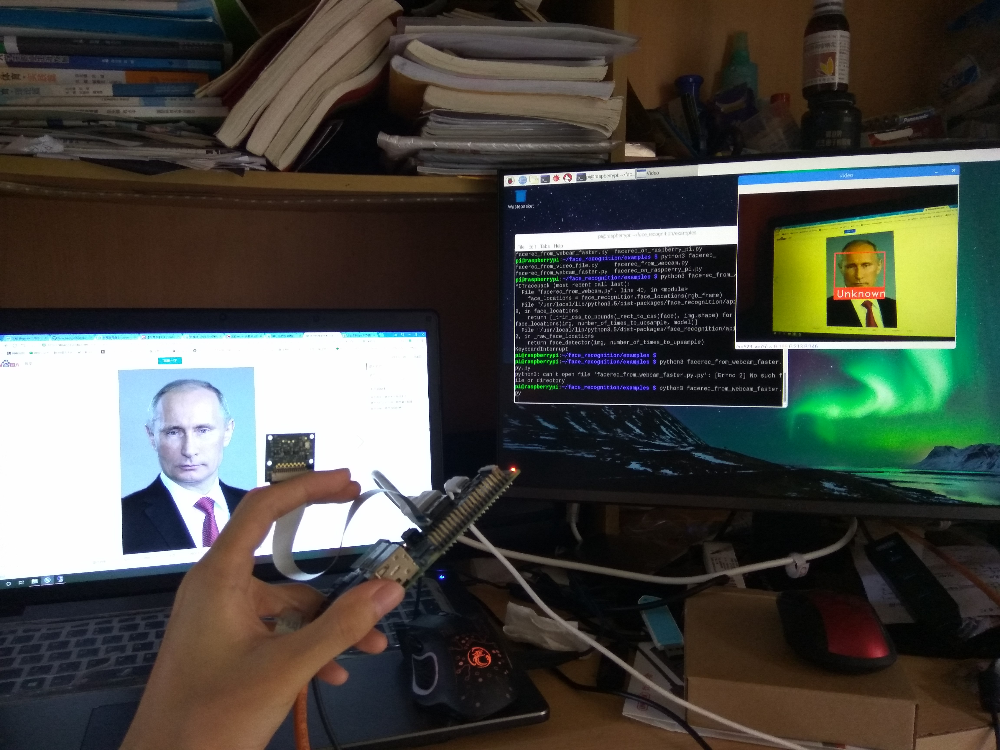

## 树莓派实时人脸识别

最近在研究 [face_recognition](https://github.com/ageitgey/face_recognition)，这个一个人脸识别的库，可以通过python调用。作者在电脑上用摄像头实现了一个实时人脸识别的效果，如下图所示。

[example](https://cloud.githubusercontent.com/assets/896692/24430398/36f0e3f0-13cb-11e7-8258-4d0c9ce1e419.gif)

我想在树莓派上实现这个效果。如果嵌入式设备也能做的这样，那就太好玩了。就像电影里的那种效果。

## 安装过程

我们可以直接参考项目页面上的安装指引 [Raspberry Pi 2+ installation instructions](https://gist.github.com/ageitgey/1ac8dbe8572f3f533df6269dab35df65)。我使用的是树莓派2B，CPU是4核900MHz，内存1GB（不过`face_recognition`只会用到单核），并且我将CPU超频到1050MHz。（关于树莓派超频，可以看我另一篇博客[树莓派超频后性能与功耗的研究](https://blog.csdn.net/imdyf/article/details/52172170)）

下面我说一下我的安装步骤。(怎么装系统就不说了，网上大把。装完记得修改源，我在学校，用中科大的源。)

先安装一大堆需要的库：

```shell
sudo apt-get update
sudo apt-get install build-essential \
    cmake \
    gfortran \
    git \
    wget \
    curl \
    graphicsmagick \
    libgraphicsmagick1-dev \
    libatlas-dev \
    libavcodec-dev \
    libavformat-dev \
    libboost-all-dev \
    libgtk2.0-dev \
    libjpeg-dev \
    liblapack-dev \
    libswscale-dev \
    pkg-config \
    python3-dev \
    python3-numpy \
    python3-pip \
    zip
```

如果使用树莓派的摄像头（CSI接口的那个），执行下面的命令：

```shell
sudo apt-get install python3-picamera
sudo pip3 install --upgrade picamera[array]
```

下载安装dlib：

```shell
mkdir -p dlib
git clone -b 'v19.6' --single-branch https://github.com/davisking/dlib.git dlib/
cd ./dlib
sudo python3 setup.py install --compiler-flags "-mfpu=neon"
```

安装`face_recognition`：

```shell
sudo pip3 install face_recognition
```

下载示例代码并尝试运行：

```shell
git clone --single-branch https://github.com/ageitgey/face_recognition.git
cd ./face_recognition/examples
python3 facerec_on_raspberry_pi.py
```

到这里我出现了报错，说缺少了一个库。一般缺少库的话，我们会先用`apt-cache search 库名`来搜索到那个库的安装包，然后用`sudo apt-get install 包名`来安装。

这里报错说缺少了`libatlas.so.3`，那我们就用`apt-cache search libatlas`来搜索，发现它的包名叫`libatlas3-base`，所以我们用`sudo apt-get install libatlas3-base`来安装。后面测试摄像头的时候也会遇到这样的问题，解决办法是一样的。

安装完之后，代码正常运行。

我们的目标是**树莓派实时人脸识别**，所以我们把树莓派的摄像头（CSI接口的那个）装上，并且在`raspi-config`中启用摄像头，然后重启。（如果不懂的话请搜索一下“树莓派摄像头使用”）

然后我们运行一下实时人脸识别的代码：

```shell
python3 facerec_from_webcam_faster.py
```

会报错，在`import cv2`的时候缺少什么库，然后根据提示用之前安装方法安装就好了。装完一个库再运行的时候，发现又提示缺少别的库，然后再安装缺少的库，这样反复个三四次，就把缺少的库都装好了，然后就不再报缺少库的错误了。（库名我都忘了，反正很快就弄好的了）

不过再次运行的时候，会报别的错误，出错的代码是`small_frame = cv2.resize(frame, (0, 0), fx=0.25, fy=0.25)`，这是因为`video_capture.read()`没有读到图片。摄像头都装了，为什么会读不出图片呢？难道摄像头坏了？不是。

> 这是因为树莓派中的camera module是放在/boot/目录中以固件形式加载的，不是一个标准的V4L2的摄像头驱动，所以加载起来之后会找不到/dev/video0的设备节点。[来源：【树莓派】在OpenCV中调用CSI摄像头](https://blog.csdn.net/deiki/article/details/71123947)

所以我们可以使用下面的命令来加载驱动模块，就没问题了：

```shell
sudo modprobe bcm2835-v4l2
```

如果想开机自动加载，我们可以修改`/etc/modules`文件，添加一行：

```
bcm2835-v4l2
```

如下图所示：



然后，我们再运行代码进行测试：

```shell
python3 facerec_from_webcam_faster.py
```

现在代码能正常运行了。会弹出一个图像框，里面显示出摄像头的拍摄内容。下面是我的测试图片：




