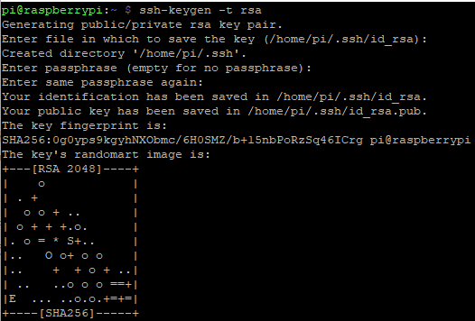
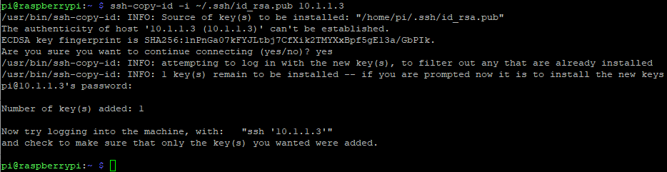
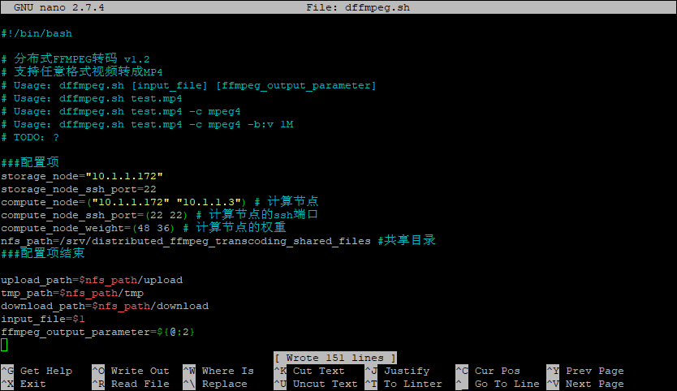
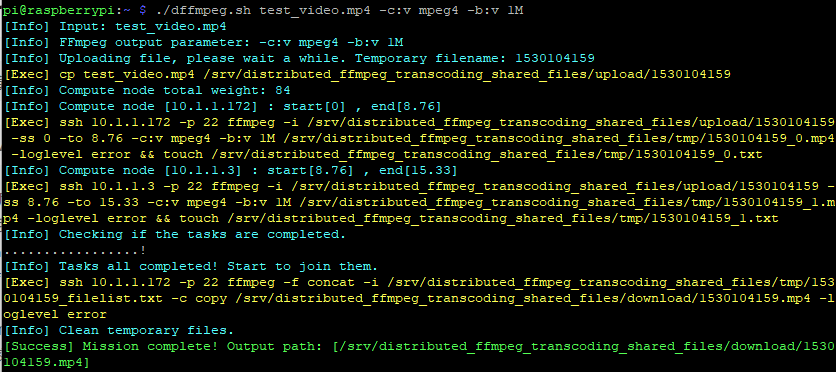

## 前言

- 关于分布式FFMPEG转码的信息可以看我之前的博客： https://blog.csdn.net/imdyf/article/details/80621009 
- 代码托管在GitHub上： https://github.com/chn-lee-yumi/distributed_ffmpeg_transcoding_cluster 
- 事实上这个集群可以使用不同架构的CPU，你可以用几个树莓派，加几台x86的电脑，它们可以一起工作，这个我们在文章末尾再讲。
- 我们先使用树莓派来搭建集群。这里有一个树莓派2B，一个树莓派3B。我的电脑是win10，用于烧录系统和配置树莓派。
- 集群节点角色分三种：控制（一个）、计算（至少一个）、存储（一个）。每个节点可以部署一个或多个角色。我们的角色分配如下：

|节点|角色|
|---|---|
|树莓派3B|控制、计算、存储|
|树莓派2B|计算|

## 准备工作

- 首先需要上raspberrypi.org下载最新的树莓派镜像，我这里用raspbian。然后用win32diskimager烧录到TF卡，接着在boot-分区创建一个名为ssh的空文件。现在就可以插到树莓派上开机了。
- 树莓派开机后，在路由器页面看到树莓派的IP地址，然后用putty进行ssh连接，用户名pi，密码raspberry。
- 我的树莓派2B的IP地址是：10.1.1.3；树莓派3B的IP地址是：10.1.1.172。
- **不管哪个节点，进去后都先进行下面这一步：**
- 换国内软件源。我这里用清华大学的源。根据使用说明 https://mirrors.tuna.tsinghua.edu.cn/help/raspbian/ ，执行`sudo nano /etc/apt/sources.list`并把文件修改成如下内容：

```
deb http://mirrors.tuna.tsinghua.edu.cn/raspbian/raspbian/ stretch main non-free contrib
deb-src http://mirrors.tuna.tsinghua.edu.cn/raspbian/raspbian/ stretch main non-free contrib
```

- 按`Ctrl+O`保存，再按`Ctrl+X`退出。
- 然后执行`sudo apt-get update`进行更新。

### 树莓派3B配置

#### 存储

- 集群中，共享存储是十分重要的，所以我们先配置存储

```shell
sudo apt-get install nfs-kernel-server
sudo chmod 777 /var/lib/nfs/.etab.lock
sudo chmod 777 /var/lib/nfs
sudo mkdir -p /srv/distributed_ffmpeg_transcoding_shared_files
sudo chmod 777 /srv/distributed_ffmpeg_transcoding_shared_files
mkdir /srv/distributed_ffmpeg_transcoding_shared_files/upload
mkdir /srv/distributed_ffmpeg_transcoding_shared_files/tmp
mkdir /srv/distributed_ffmpeg_transcoding_shared_files/download
```

- 运行`sudo nano /etc/exports`，将文件内容修改成如下：

```
/srv/distributed_ffmpeg_transcoding_shared_files/upload 10.1.1.3(ro,insecure)
/srv/distributed_ffmpeg_transcoding_shared_files/tmp 10.1.1.3(rw,insecure)
```

- 其中10.1.1.3是树莓派2B的IP地址（计算节点）。
- 假如你有三个计算节点，它们的IP是10.1.1.3-10.1.1.5，可以写成如下形式：

```
/srv/distributed_ffmpeg_transcoding_shared_files/upload 10.1.1.3(ro,insecure) 10.1.1.4(ro,insecure) 10.1.1.5(ro,insecure)
/srv/distributed_ffmpeg_transcoding_shared_files/tmp 10.1.1.3(rw,insecure) 10.1.1.4(rw,insecure) 10.1.1.5(rw,insecure)
```

- 如果存储节点也是计算节点，不需要存储节点写上。因为存储节点不需要挂载NFS。
- 修改完成后，执行下面这条命令使配置生效：

```shell
exportfs -arv
```

#### 计算

- 计算角色配置十分简单，只要执行下面一条命令

```shell
sudo apt-get install ffmpeg
```

#### 控制

- 首先我们要设置免密码SSH。先执行`ssh-keygen -t rsa`生成key，期间会让你输入一些参数，我们采用默认参数，直接回车。
- 结果如下图：

- 然后执行下面的命令`ssh-copy-id -i ~/.ssh/id_rsa.pub 10.1.1.3`，将公钥复制到树莓派2B。（10.1.1.3是树莓派2B的IP地址）
- 期间会问你一些东西，我们先输入yes，回车，然后输入raspberry（输入这个的时候不会有显示），回车。结果如下图：

- 因为树莓派3B也是计算节点，我们也要复制公钥。使用命令`ssh-copy-id -i ~/.ssh/id_rsa.pub 10.1.1.172`，其余操作同上。
- 如果还有别的节点，修改命令的IP地址为目标节点，再执行这样的命令。
- 这样免密码SSH就设置好了。接下来我们下载控制脚本，执行如下命令：

```shell
wget https://raw.githubusercontent.com/chn-lee-yumi/distributed_ffmpeg_transcoding_cluster/master/dffmpeg.sh
chmod +x dffmpeg.sh
```

- 然后我们需要修改控制脚本的配置。执行`nano dffmpeg.sh`，将配置项部分修改成如下内容：

- 主要要修改的部分：storage_node的值IP改成存储节点的IP地址，这里是10.1.1.172。compute_node的值改成计算节点的IP地址，这里是10.1.1.172和10.1.1.3。compute_node_weight的值改成各计算节点的权重（性能越好权重应该设置得越大）。我这里将树莓派3B设成48，树莓派2B设成36。
- 最后，我们还需要安装一个小软件，执行命令`sudo apt-get install bc`进行安装。

### 树莓派2B配置

- 它只有一个计算角色，要配置的东西很少，我们只要安装ffmpeg和挂载共享存储。执行如下命令：

```shell
sudo apt-get install ffmpeg
sudo mkdir -p /srv/distributed_ffmpeg_transcoding_shared_files
sudo chmod 777 /srv/distributed_ffmpeg_transcoding_shared_files
mkdir /srv/distributed_ffmpeg_transcoding_shared_files/upload
mkdir /srv/distributed_ffmpeg_transcoding_shared_files/tmp
sudo mount 10.1.1.172:/srv/distributed_ffmpeg_transcoding_shared_files/upload /srv/distributed_ffmpeg_transcoding_shared_files/upload
sudo mount 10.1.1.172:/srv/distributed_ffmpeg_transcoding_shared_files/tmp /srv/distributed_ffmpeg_transcoding_shared_files/tmp
```

- 其中10.1.1.172是存储节点（也就是树莓派3B）的IP地址。

## 测试

- 测试在控制端进行。首先先下载个测试视频。如果你没有合适的视频，可以用我在网上找的。执行下面的命令进行下载：

```shell
wget https://github.com/chn-lee-yumi/distributed_ffmpeg_transcoding_cluster/blob/master/test_video.mp4?raw=true
```

- 下载后的文件名后缀不对，我们改一下：`mv test_video.mp4?raw=true test_video.mp4`
- 然后我们就可以开始正式测试分布式FFMpeg转码了。执行下面的命令：

```shell
 ./dffmpeg.sh test_video.mp4 -c:v mpeg4 -b:v 1M
```

- 其中mpeg4是编码格式，1M是视频码率。我们把test_video.mp4转码成mpeg4格式，视频码率为1Mbps。
- 执行效果如下图：


## 结束语

- 在这个过程中发现一个奇怪的bug：ffmpeg还在运行但已经执行了后面的touch语句。会导致最后视频拼接出错。临时解决办法是修改控制脚本配置项的`sync_wait_time`。该BUG原因不明，但不是因为使用了NFS的问题，因为在存储节点没有使用NFS也会出现此情况。该问题留待解决。
- 这个集群是可以加入x86的计算机的，只要按照配置步骤，安装ffmpeg，开启免密码ssh，挂载共享存储，在控制脚本加入节点，就可以了。
