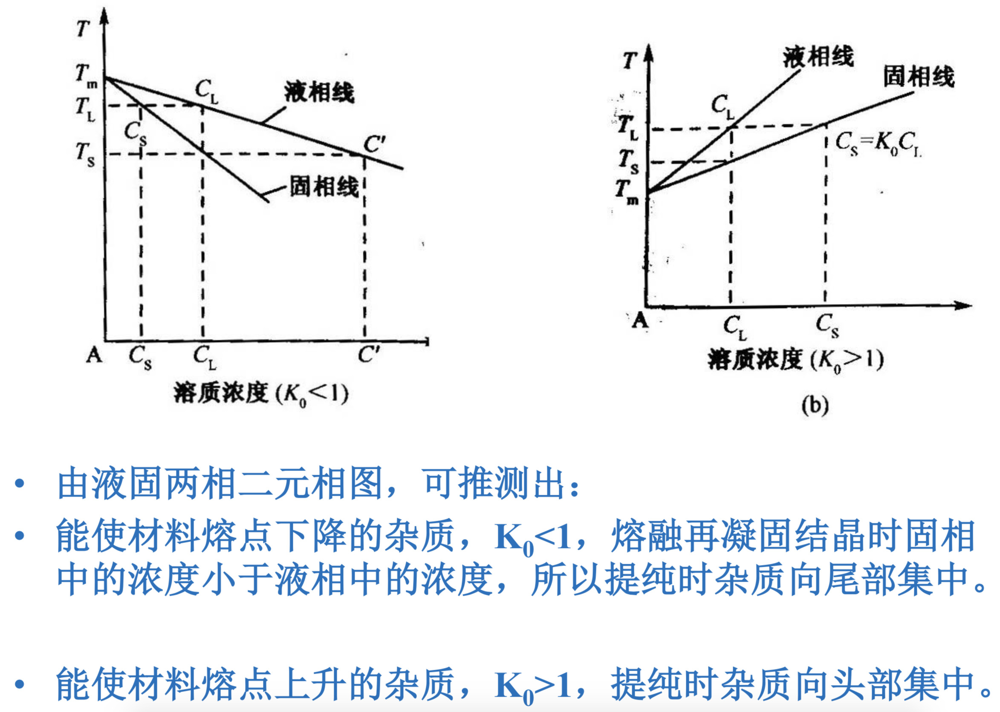
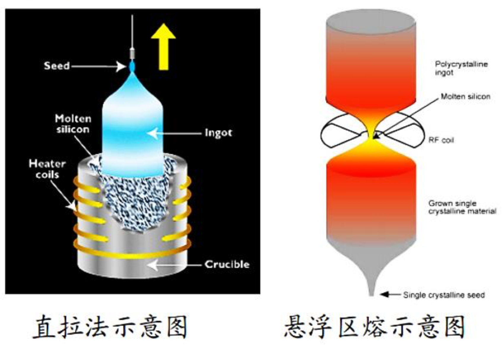
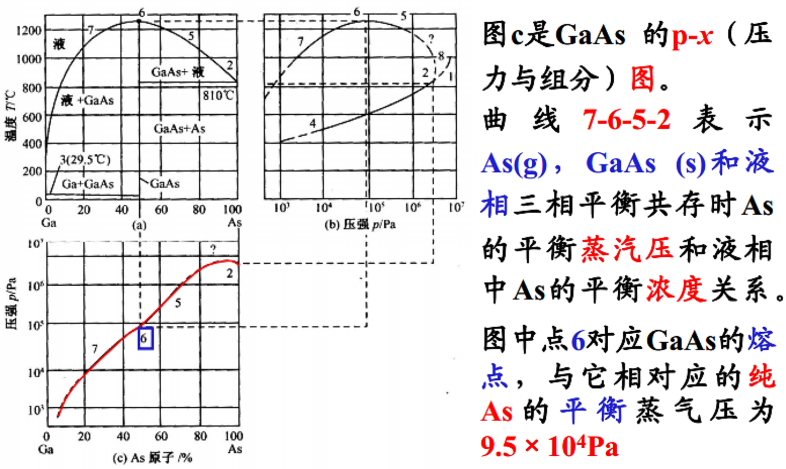
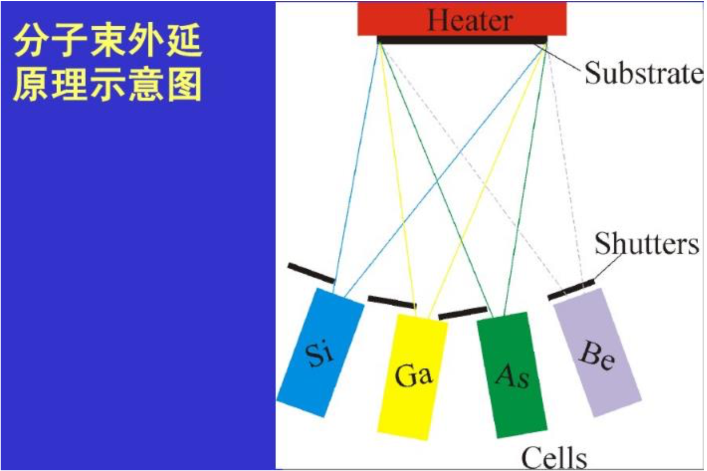

## 半导体的主要特性

- 电阻率：10^-3^~10^9^ $\Omega$·cm
- 负温度系数：T升高，电阻率减小
- 具有高热电势
- 整流效应
- 光敏特性
- 掺杂可以提高导电能力

## 第一章 硅和锗的化学制备

### 高纯硅的制备

先由**硅石**（二氧化硅）制得**工业硅**（粗硅——纯度低、杂质多），再制成高纯**多晶硅**，经拉制得到**单晶硅**。

### 粗硅的制备

- 原料：石英砂（$SiO_2$）和硅酸盐（$Na_2SiO_3$）
- 方法：石英砂与碳在碳电极的电弧炉中还原，可制得纯度为97%的粗硅。

- 反应温度下硅是气相，然后凝固成固相。 

### 高纯多晶硅的化学制备

- 三氯氢硅（$SiHCl_3$）氢还原法 ：$SiHCl_3$提纯的主要方法是精馏，可将$SiHCl_3$的纯度从97%-98%提纯到9个9到10个9。
- 硅烷（$SiH_4$）法：
   - 硅烷的提纯：吸附法（分子筛、活性炭）
   - 硅烷的热分解
- 四氯化硅（$SiCl_4$）还原法：硅的吸收率低。

## 第二章 区熔提纯

### 分凝现象

将含有杂质的晶态物质熔化后再结晶时，杂质在结晶的固体和未结晶的液体中的浓度是不同的，这种现象称为分凝现象或偏析现象。

### 区熔提纯

区熔提纯就是利用分凝现象将物料局部熔化形成狭窄的熔区，并令其沿锭长一端缓慢地移动到另一端，重复多次使杂质尽可能集中在头部或尾部，进而达到使中部材料提纯的目的。

### 平衡分凝系数

平衡分凝系数是在**一定温度下**，**平衡状态时**，杂质在固液两相中浓度的比值。描述了固液平衡体系中杂质的分配关系。  

${平衡分凝系数}=\frac{杂质在固相中的浓度C_S}{杂质在液相中的浓度C_L}$

### 正常凝固

**将一锭条全部融化后，使其从一端向另一端逐渐凝固的方式称为正常凝固。**  

由于存在分凝现象，正常凝固后的锭条中的杂质分布不再均匀，会出现三种情况：

- K<1的杂质，越接近尾部浓度越大，杂质向尾部集中
- K>1的杂质，越接近头部浓度越大，杂质向头部集中
- K≈1的杂质，基本保持原有的均匀分布的方式。

## 第三章 晶体生长

- 晶体是在物相转变的情况下形成的。由气相、液相转变成固相可形成晶体，固相之间也可以直接转变。
- 晶体生长方式：固相生长、液相生长（包括溶液生长和熔体生长）、气相生长。

- 晶核：从结晶母相中析出，并达到某个临界大小，从而得以继续成长的结晶相微粒。（晶体形成的一般过程是先生成晶核，再逐渐长大。）
- 成核作用：形成晶核的过程。
   - 均匀成核（自发成核）：在一定**过饱和度**、**过冷度**的情况下，由体系中**直接形成**的晶核。
   - 非均匀成核（非自发成核）：体系中存在**外来质点**（尘埃、固体颗粒、籽晶等），在**外来质点**上成核。
- 硅单晶的生长常采用**直拉法**和**悬浮区熔法**。
- 锗单晶的生长主要用**直拉法**。

### 直拉法

### 悬浮区熔法

## 第四章 硅、锗晶体中的杂质

### 影响单晶内杂质数量和分布的主要因素

- 原料中的杂质种类和含量
- 杂质的分凝效应
- 杂质的蒸发效应
- 生长过程中坩锅或系统内杂质的玷污
- 加入杂质量

这些因素的大小随材料和拉晶工艺而变动，应针对问题具体分析。

### 掺杂量的计算

- 只考虑杂质分凝时的掺杂计算（轻掺杂时）
- **采用母合金投入，计算母合金用量**
- **母合金中杂质浓度$C_m$的求法**
- 考虑坩锅污染及蒸发的掺杂计算
- 实际拉制P型硅及N型硅的掺杂计算
- 经验公式

### 只考虑杂质分凝时的掺杂

$杂质质量=\frac{杂质浓度\times单晶质量\times摩尔质量}{密度\times阿伏伽德罗常数}=\frac{个 \cdot cm^{-3} \times g \times g \cdot mol^{-1}}{g \cdot cm \times 个 \cdot mol^{-1}}=g$

### 实际生产中的近似估算

## 第五章 硅外延生长

- **外延**是指在单晶衬底上，按衬底晶向生长一层单晶层的技术。
- 按相变过程分为：固相外延（SPE）、液相外延（LPE）、气相外延（VPE）。
- 对于**硅外延**，应用**最广泛的是气相外延**：以$SiH_2Cl_2$、$SiHCl_3$、$SiCl_4$或$SiH_4$为反应气体，在一定保护气氛下反应生成硅原子并沉积在加热的衬底上，衬底材料一般选用$Si$、$SiO_2$、$Si_3N_4$等。
- 对外延片的质量要求：电阻率及其均匀性、厚度及其均匀性、位错和层错密度等。
- 按反应类型分为：
   - 氢气还原法：利用氢气还原产生的硅在基片上进行外延生长。
   - 直接热分解法：利用热分解得到硅。

- 自掺杂效应：衬底中的杂质进入气相中再掺入外延层。
- 硅的异质外延：在蓝宝石、尖晶石衬底上进行硅的SOS外延生长和在绝缘衬底上进行硅的SOI异质外延。
   - SOS：Silicon on Sapphire or Spinel。在单晶绝缘衬底蓝宝石($α-Al_2O_3$)或尖晶石 ($MgO \cdot Al_2O_3$)上外延生长硅。
   - SOI：Silicon or Semiconductor on Insulator。

## 第六章 III-V族化合物半导体

- 原子序数之和：由小到大
   - 材料熔点：由高到低
   - 禁带宽度：由大到小

### 与Si相比III-V族化合物半导体的性质

- **带隙较大**，大部分室温时大于1.1eV，因而所制造的器件耐受较大功率，工作温度更高。
- 大都为**直接跃迁**型能带，因而其光电转换效率高，适合制作光电器件，如LED、LD、太阳能电池等。GaP虽为间接带隙，但Eg较大（2.25eV），掺入等电子杂质所形成的束缚激子发光仍可得到较高的发光效率。是红（Zn-O、Cd-O）、黄（Bi）、绿（N）光LED的主要材料之一。
- 电子迁移率高，很适合制作高频、高速器件。

### 平衡相图

平衡相图是指物质（多相体系）的各种状态（固相或液相等）在平衡时组分与温度（或压力）之间变化关系的一种图像。

### GaAs单晶的制备方法

- **熔体中制备**单晶，按照**控制As气压的方式**，有两种方法：
   - 水平布里奇曼法（HB）：采用**石英密封系统**，系统置于**双温区**炉中，**低温端放As源**控制系统中As气压，**高温端合成化合物**并**拉制晶体**，而整个系统的温度都必须高于As源端温度，防止As蒸汽凝结。这种方法**污染少**，**纯度较高**。
   - 液态密封法（LEP或LEC）

#### 水平布里奇曼法（HB）

在抽真空的石英管内，一端放盛高纯镓的舟，另一端放高纯砷。镓端位于高温区，砷端位于低温区。升温后，砷扩散到镓中形成GaAs。当合成反应达到平衡后，再以定向结晶的方式进行单晶生长。

#### 液态密封法（LEP/LEC）

在熔体上覆盖透明而粘滞的**惰性熔体**，再向单晶炉内充入大于熔体离解压的**惰性气体**，以控制熔体离解，一般惰性熔体用的是$B_2O_3$，所以这种方法通常被称为$B_2O_3$液态密封法。这种方法可以批量生产大直径具有一定晶向的单晶，生产效率高，而且利用这种方法可以生产**高离解压的磷化物**。

## 第七章 III-V族化合物半导体的外延生长

- 气相外延生长（VPE）
   - 卤化物法
   - 氢化物法
   - 金属有机物气相外延生长（MOVPE）
- 液相外延生长（LPE）
- 分子束外延生长（MBE）

### 气相外延

- 最常用的外延方法。在**衬底**表面造成生长物原子的**过饱和**，趋势气相中的生长物原子并入固相，在衬底表面外延生长出晶体**薄膜**。
- 气相外延的温度通常远低于同种材料块状晶体的生长温度，生长时的过饱和度与块状晶体相比也比较低，这导致外延生长的速率一般情况下远低于块状晶体的生长速率。这一特点决定了其为**薄膜制备**手段的应用。

####  卤化物法外延生长GaAs

#### MOVPE技术概述

- MOVPE技术是生长化合物半导体薄层晶体的方法。
- 它是采用III族元素的有机化合物和V族元素的氢化物等作为晶体生长的源材料，以热分解方式在衬底上进行外延生长III-V族化合物半导体以及它们的多元化合物的薄层单晶。
- III族金属有机化合物一般使用它们的烷基化合物，如Ga、Al等的甲基或乙基化合物：$Ga(CH_3)_3$、$Ga(C_2H_5)_3$等。

### 分子束外延生长（MBE）

在**超高真空系统**中，分子束源炉与被加热的衬底相对放置。将组成化合物的各个元素和掺杂元素分别放入不同的源炉内。加热源炉使分子（原子）以一定的热运动速度和一定的束流强度比例喷射到衬底表面上，与表面相互作用，进行单晶薄膜的外延生长。各源炉前的**挡板**用来改变外延层的组分和掺杂。根据设定的时间开关挡板、改变**炉温**和控制生长时间，就可以生长出不同厚度、不同组分、不同掺杂浓度的外延材料。

- 在超真空容器内蒸发金属，获得金属分子束，并使之碰撞在基片上进行外延生长。
   - 优点：生长真空度高、温度低和生长速度小。
   - 不足：成本昂贵且不适用于同时多个衬底生长。
	
## 第八章 III-V族多元化合物半导体

- III-V族二元化合物的**晶格常数**和**禁带宽度**等都是一定的，在应用时时常受到限制。
- 在异质外延层和衬底或相邻的两个外延层之间，如果存在晶格常数的差异，称之为**晶格失配**。
- 三元固溶体可以通过调整**组分**来调整材料的**带隙**，对于**发光器件**来说可以调整**发光波长**。
- 但组分确定后，固溶体的晶格常数也随之确定，这时就会遇到其外延生长材料与晶格不匹配的问题。
- 使用**四元**固溶体可增加一个对其主要性能进行调整和裁剪的自由度，即可通过两种**组元**的成分改变来调整其**带隙和晶格常数**。

- 超晶格是一种新型结构的半导体化合物，它是**由两种极薄的不同材料的半导体单晶薄膜周期性地交替生长的多层异质结构**。相邻两层不同材料的厚度的和称为**超晶格的周期长度**。

## 第九章 II-VI族化合物半导体

- II族元素和VI族元素在周期表中的位置相距比III族和V族的大，故II-VI族的**负电性差值大**，其**离子键成分**比III-V族化合物大。
- 禁带宽度变化范围大，具有**直接跃迁**的能带结构。在**固体发光、激光、红外、压电效应**等器件方面都有着广泛的应用。
- **熔点较高**，在熔点下具有一定的气压，而且组成化合物的单质蒸汽压也比较高。

- 掺入的杂质被由于杂质的掺入而形成的相反电荷类型的缺陷中心所补偿，这种现象称为**自补偿现象**。

