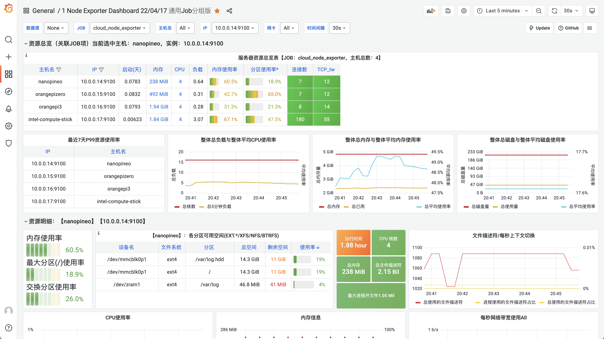

## 前言

家里积灰的各种小派太多，就掏出来折腾下。用M3尼龙柱搭了个小机架。


部署完成后接了Grafana。



另外，千万不要买这种一分四的USB线！淘宝十来块钱，质量特别特别差……还会有玄学问题，板子通电亮灯了，就是启动不了（网络不通）。估计是线阻抗太大了或者线头接触不良。我最后还是找了几个充电头和几根线，加个排插来供电。


## 部署步骤

下载：[https://www.downloadkubernetes.com/](https://www.downloadkubernetes.com/)

国内墙了，得设置代理：

```shell
PROXY=10.0.0.42
export https_proxy=http://$PROXY:7890 http_proxy=http://$PROXY:7890 all_proxy=socks5://$PROXY:7890
```

容器运行时我选择CRI-O：[https://github.com/cri-o/cri-o/blob/main/install.md#apt-based-operating-systems](https://github.com/cri-o/cri-o/blob/main/install.md#apt-based-operating-systems)

```shell
OS=xUbuntu_22.04
VERSION=1.26

echo "deb [signed-by=/usr/share/keyrings/libcontainers-archive-keyring.gpg] https://download.opensuse.org/repositories/devel:/kubic:/libcontainers:/stable/$OS/ /" > /etc/apt/sources.list.d/devel:kubic:libcontainers:stable.list
echo "deb [signed-by=/usr/share/keyrings/libcontainers-crio-archive-keyring.gpg] https://download.opensuse.org/repositories/devel:/kubic:/libcontainers:/stable:/cri-o:/$VERSION/$OS/ /" > /etc/apt/sources.list.d/devel:kubic:libcontainers:stable:cri-o:$VERSION.list

mkdir -p /usr/share/keyrings
curl -L https://download.opensuse.org/repositories/devel:/kubic:/libcontainers:/stable/$OS/Release.key | gpg --dearmor -o /usr/share/keyrings/libcontainers-archive-keyring.gpg
curl -L https://download.opensuse.org/repositories/devel:/kubic:/libcontainers:/stable:/cri-o:/$VERSION/$OS/Release.key | gpg --dearmor -o /usr/share/keyrings/libcontainers-crio-archive-keyring.gpg

apt-get update
apt-get install -y cri-o cri-o-runc
```

```shell
wget https://github.com/containernetworking/plugins/releases/download/v1.2.0/cni-plugins-linux-amd64-v1.2.0.tgz

tar axvf ./cni-plugins-linux-*.tgz  -C /opt/cni/bin/

mkdir /var/lib/crio/
systemctl enable crio
systemctl start crio
modprobe br_netfilter
echo br_netfilter >> /etc/modules
apt-get install -y socat conntrack
echo net.ipv4.ip_forward=1 >> /etc/sysctl.conf
```

```shell
# 自动安装

sudo curl -fsSLo /etc/apt/keyrings/kubernetes-archive-keyring.gpg https://packages.cloud.google.com/apt/doc/apt-key.gpg
echo "deb [signed-by=/etc/apt/keyrings/kubernetes-archive-keyring.gpg] https://apt.kubernetes.io/ kubernetes-xenial main" | sudo tee /etc/apt/sources.list.d/kubernetes.list
apt-get update
apt-get install -y kubelet kubeadm kubectl
apt-mark hold kubelet kubeadm kubectl

# 自动安装，如果开启swap，需修改/etc/systemd/system/kubelet.service.d/10-kubeadm.conf，增加：
Environment="KUBELET_EXTRA_ARGS=--fail-swap-on=false"

# 手动安装

wget https://dl.k8s.io/v1.26.1/bin/linux/amd64/kubectl https://dl.k8s.io/v1.26.1/bin/linux/amd64/kubelet https://dl.k8s.io/v1.26.1/bin/linux/amd64/kubeadm

wget https://dl.k8s.io/v1.26.1/bin/linux/arm64/kubectl https://dl.k8s.io/v1.26.1/bin/linux/arm64/kubelet https://dl.k8s.io/v1.26.1/bin/linux/arm64/kubeadm

sudo install -o root -g root -m 0755 kubectl /usr/local/bin/kubectl
sudo install -o root -g root -m 0755 kubelet /usr/local/bin/kubelet
sudo install -o root -g root -m 0755 kubeadm /usr/local/bin/kubeadm

mkdir /etc/kubernetes/manifests

wget https://github.com/kubernetes-sigs/cri-tools/releases/download/v1.26.0/crictl-v1.26.0-linux-amd64.tar.gz

tar xzf crictl*.gz
sudo install -o root -g root -m 0755 crictl /usr/local/bin/crictl
```

手动安装kubelet额外步骤：

```shell
# wget https://raw.githubusercontent.com/kubernetes/release/master/cmd/kubepkg/templates/latest/deb/kubelet/lib/systemd/system/kubelet.service -O /lib/systemd/system/kubelet.service
# /usr/bin/kubelet --bootstrap-kubeconfig=/etc/kubernetes/bootstrap-kubelet.conf --kubeconfig=/etc/kubernetes/kubelet.conf --pod-manifest-path=/etc/kubernetes/kubelet.d --config=/var/lib/kubelet/config.yaml --network-plugin=cni --pod-infra-container-image=registry.aliyuncs.com/google_containers/pause:3.5
# kubelet需要手动加一堆参数才能起来，默认参数不能用

cat > /etc/systemd/system/kubelet.service << EOF
[Unit]
Description=kubelet: The Kubernetes Node Agent
Documentation=https://kubernetes.io/docs/home/
Wants=network-online.target crio.service
After=network-online.target

[Service]
ExecStart=/usr/local/bin/kubelet --container-runtime-endpoint=unix:///var/run/crio/crio.sock --fail-swap-on=false --pod-infra-container-image=registry.cn-hangzhou.aliyuncs.com/google_containers/pause:3.9 --config=/var/lib/kubelet/config.yaml --kubeconfig=/etc/kubernetes/kubelet.conf --bootstrap-kubeconfig=/etc/kubernetes/bootstrap-kubelet.conf
Restart=always
StartLimitInterval=0
RestartSec=10

[Install]
WantedBy=multi-user.target
EOF

systemctl daemon-reload
systemctl enable kubelet
```

```shell
# https://github.com/cri-o/cri-o/issues/5931
cat >> /etc/containers/registries.conf << EOF
[[registry]]
prefix = "registry.k8s.io"
location = "registry.cn-hangzhou.aliyuncs.com/google_containers"
[[registry]]
prefix = "k8s.gcr.io/sig-storage"
location = "registry.cn-hangzhou.aliyuncs.com/google_containers"
[[registry]]
prefix = "k8s.gcr.io/metrics-server"
location = "registry.cn-hangzhou.aliyuncs.com/google_containers"
EOF

# 添加到/etc/crio/crio.conf
pause_image = "registry.cn-hangzhou.aliyuncs.com/google_containers/pause:3.9"
```

仅第一个节点运行：

```shell
cat > kubeadm-config.yml << EOF
apiVersion: kubeadm.k8s.io/v1beta3
kind: ClusterConfiguration
imageRepository: registry.cn-hangzhou.aliyuncs.com/google_containers
EOF

# kubeadm config images pull --config=kubeadm-config.yml
# kubeadm reset -f
kubeadm init --config=kubeadm-config.yml
```

然后会看到如下输出：

```shell
Your Kubernetes control-plane has initialized successfully!

To start using your cluster, you need to run the following as a regular user:

  mkdir -p $HOME/.kube
  sudo cp -i /etc/kubernetes/admin.conf $HOME/.kube/config
  sudo chown $(id -u):$(id -g) $HOME/.kube/config

Alternatively, if you are the root user, you can run:

  export KUBECONFIG=/etc/kubernetes/admin.conf

You should now deploy a pod network to the cluster.
Run "kubectl apply -f [podnetwork].yaml" with one of the options listed at:
  https://kubernetes.io/docs/concepts/cluster-administration/addons/

Then you can join any number of worker nodes by running the following on each as root:

kubeadm join 10.0.0.17:6443 --token bn4hd5.lhsjrewbd8blsxh4 \
	--discovery-token-ca-cert-hash sha256:ed9a2f35a1cb118eab66d651d3e9b5b4c1d00d7fb033bfc447b076c63ccfda2d 
```

```shell
kubectl patch node $(hostname) -p '{"spec":{"podCIDR":"10.244.17.0/24"}}'
kubectl patch node orangepi3 -p '{"spec":{"podCIDR":"10.244.16.0/24"}}'
kubectl patch node orangepizero -p '{"spec":{"podCIDR":"10.244.15.0/24"}}'
kubectl patch node nanopineo -p '{"spec":{"podCIDR":"10.244.14.0/24"}}'
kubectl apply -f https://github.com/flannel-io/flannel/releases/latest/download/kube-flannel.yml
```

## B站视频

备选标题：
- 我用家里的电子垃圾搭了个k8s集群，最小节点内存256MB。
- 256M内存也能跑k8s！？【群友推荐】
- 用各种派自建k8s集群
- 超迷你四节点k8s集群【ChatGPT推荐标题】

关于本次视频标题，我询问了ChatGPT，它给出的回答如下：

```
我认为最合适的标题是：“超迷你四节点k8s集群”，因为它简洁明了地概括了视频的内容和亮点。同时，它也能吸引人们的注意力，因为这个集群不仅使用了家里的电子垃圾，而且最小节点内存只有256MB，非常迷你。

其他不错的标题建议如下：

“家里的废物再利用：看我如何搭建k8s集群！”
“256MB内存的小板子也能成为k8s节点？”
“各种小板子组合出大作为：自建k8s集群实战”
“从废旧电子到高效k8s集群：看我如何打造超迷你系统”
```

256MB内存的小板子也能成为k8s节点！我以前喜欢买各种小板子，现在手上一堆板，我把他们组成一个 k8s 集群。这个集群有四个节点，总计16核心，2.75GB 内存。最小的节点内存只有 256MB。

<iframe style="height:360px;width:640px" src="//player.bilibili.com/player.html?aid=442688262&bvid=BV1PL411v7p7&cid=1099870376&page=1&autoplay=0" scrolling="no" border="0" frameborder="no" framespacing="0" allowfullscreen="true"> </iframe>

## 视频文字稿

我以前喜欢买各种小板子，我现在手上有两块 ARMv7 的板子，一块 ARM64 的板子，还有一根 X86 的 Intel 电脑棒。【四个板子图片依次显示，右方写配置。】

现在我要搞波大的，把他们组成一个 k8s 集群。这个集群有四个节点，总计16核心，2.75GB 内存。【集群图，右方写集群配置汇总】

但是在这个集群里面，有三种不同的 CPU 架构，最小的节点内存只有 256MB。生命在于折腾，大家看看视频图一乐就行。

我用 kubeadm 来部署集群。因为 Docker 太吃内存，所以我用 CRI-O 作为容器运行时。【执行命令 kubectl get node -owide】

部署完之后，我在上面跑了一些服务。跑了一个自己写的 CMDB，还有一个测试用的 MySQL。可以看到就算是只有 256MB 内存的节点，也是能在上面跑一些服务的。【执行命令 kubectl get pod -owide】

当然这个集群还有些别的服务，比如做 CI/CD 用的 Jenkins，还有一些监控用的服务【执行命令 kubectl get pod -A】

执行 kubectl top node 就可以看到节点的负载情况，kubectl top pod -A 可以看 pod 的资源使用情况。

当然我也搞了个 Grafana 面板，可以在网页上直接看到各种数据。【Grafana截图】

如果大家喜欢这期视频，欢迎点赞投币收藏转发，有什么想说的也可以弹幕或评论区留言。

最后吐槽一下，不要买这种一分四的 micro USB 线，我用了两个月后这个线就不稳定了，如果你用了这种线，你会发现一个神奇的现象，【一分四USB线图片】板子灯是亮的，网络就是不通。【ping timeout 录屏】换一根线就正常了。
