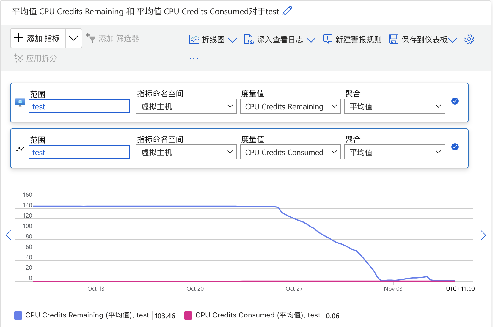

## 前言

我在 Azure 有一台虚拟机，是 B1s 系列的。最近发现变得很卡，使用`top`命令排查发现`sy`和`si`都很高：

```text
%Cpu(s): 52.1 us, 21.9 sy,  0.0 ni,  0.0 id,  0.0 wa,  0.0 hi, 26.0 si,  0.0 st
```

## 排查过程

鉴于`sy`排查会比较复杂，所以先从简单的`si`开始。使用命令`watch -n1 -d cat /proc/interrupts`查看软中断情况：

```text
           CPU0
  4:    6042775   IO-APIC   4-edge      ttyS0
  8:          0   IO-APIC   8-edge      rtc0
  9:          0   IO-APIC   9-fasteoi   acpi
NMI:          0   Non-maskable interrupts
LOC:          0   Local timer interrupts
SPU:          0   Spurious interrupts
PMI:          0   Performance monitoring interrupts
IWI:          1   IRQ work interrupts
RTR:          0   APIC ICR read retries
RES:          0   Rescheduling interrupts
CAL:          0   Function call interrupts
TLB:          0   TLB shootdowns
HYP:  303764679   Hypervisor callback interrupts
HRE:          0   Hyper-V reenlightenment interrupts
HVS:  826460279   Hyper-V stimer0 interrupts
ERR:          0
MIS:          0
PIN:          0   Posted-interrupt notification event
NPI:          0   Nested posted-interrupt event
PIW:          0   Posted-interrupt wakeup event
```

发现`HYP`和`HVS`增长速度非常快。所以很明显问题不在我的系统上，是宿主机的问题。

因为最近并没有对服务器做过什么操作，经过联想，猜测是突发的额度用完了，导致系统整体变慢。

于是登录 Azure 查看监控，可以看到 CPU Credits 确实用完了。



所以解决方案是：升级配置或者降低服务器负载。
