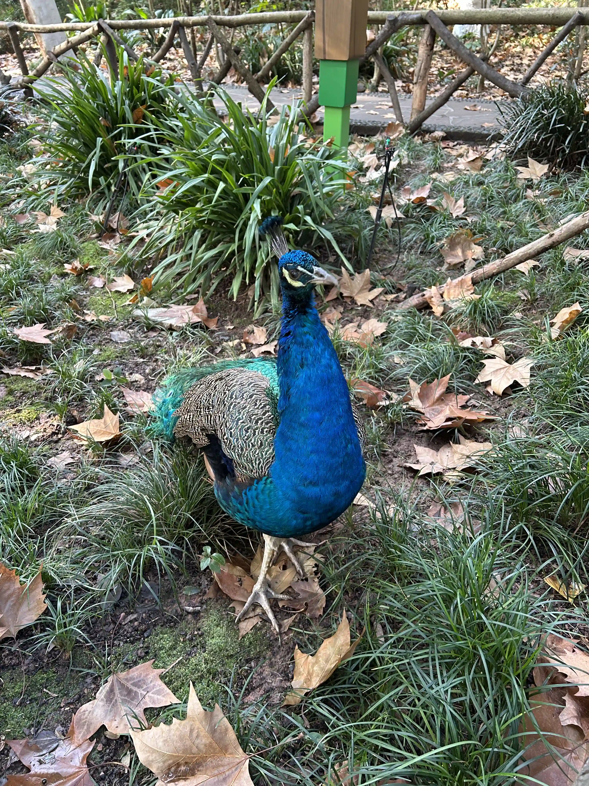
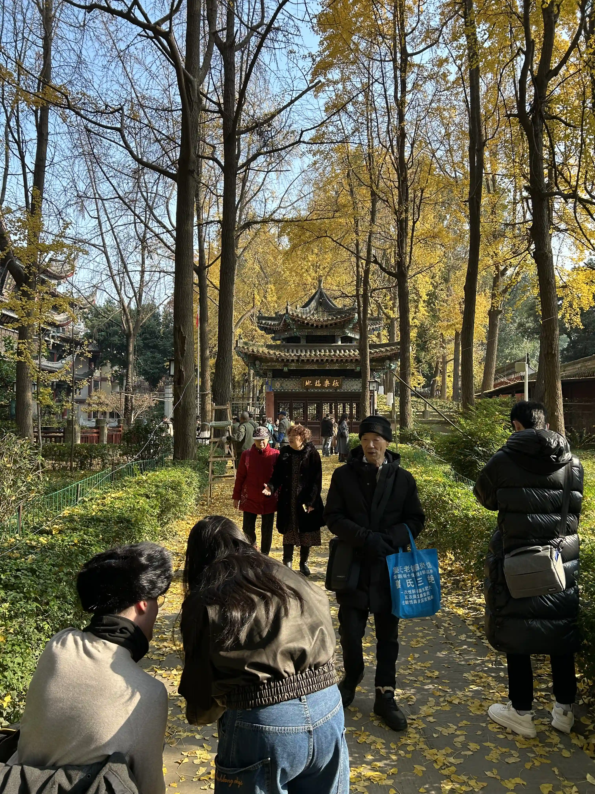
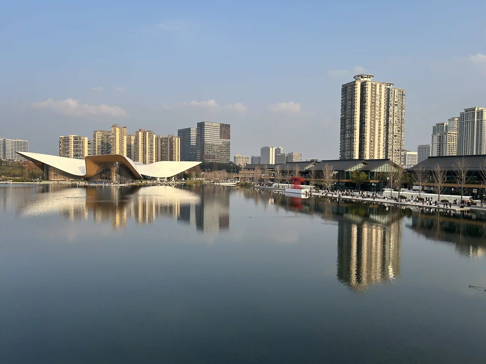

## 前言

2025年的第一篇博客献给去年12月的游记。本来应该早就开始写得了，因为这次旅游去了很多地方，玩了不少内容，怕写晚了都忘记有啥感想了。不过最终还是拖到了第二年。这也是我第一次在博客上写游记。很久以前（小学和初中的时候）我会在QQ空间上写游记，现在QQ空间我已经不用了，就把游记写到这里吧。

趁人还活着多写点东西，万一哪天死了，还能留下不少语料，说不定能用来finetune个模型，实现赛博飞升。说到赛博飞升，我觉得，对于其他人来说，如果他们和一个模型进行交互，这个模型给出的回应和我给出的回应一样，那这个模型对他们来说其实就是我了，即使模型只是在做文字接龙，并没有意识。所以这个也是我写博客的动力。

鉴于近两年大语言模型飞速发展，我半年前就开始计划赛博飞升，写了几天日记，通过prompt来让模型模仿我。结果显然是不合人意的，因此计划暂时搁置了。不过我相信等我死之前，大语言模型应该能发展到实现赛博飞升的程度。在此之前，多产出点语料，日积月累，日后才好finetune。

言归正传，下面开始游记内容。(注：照片特意保留了EXIF信息，也就是说可以看到我是在哪里拍的。)

## 旅游计划

原本计划就是先去重庆，半天逛完所有点，然后第二第三天跟旅游团去武隆（816核工程+武陵山大裂谷+武隆天生三桥+仙女山），第三天晚上高铁到成都，然后随便想玩几天玩几天，看情况回家。后来出了个初版旅游计划如下：

- 12.18 九点半出门，广州-重庆（HU7341,11:40-13:55），酒店（德艺大厦民宿）-白象居-白象街-重庆十八梯-李子坝（晚饭）-大剧院-解放碑-酒店
- 12.19-20 重庆郊区玩(https://vacations.ctrip.com/travel/detail/p39486564?city=4 ，价格775)，20:15前小什字出发到重庆西，前面随意安排
。晚上重庆西到成都东（G2882，21:50-23:07，价格129），住成都东 四季旅居酒店公寓(成都东站东广场店)
- 12.21 早上 春熙路 + 三星堆博物馆（春熙路大巴车 8:00车【现场购买】），看完回成都吃吃吃，春熙路到成都川剧艺术中心（晚上7-9上课），晚上住成都东，并确认24日后行程
- 12.22 早上 宽窄巷子少城小学买熊猫包包 + 青羊宫 + 天府人文艺术图书馆，下午成都东 (酒店取行李)到黄龙九寨（C5796，15:45-17:36，价格128），然后坐大巴到九寨沟景区（18:00，价格51，彭丰村下车），晚上住逸枫酒店
- 12.23 九寨沟旅游【门票待买，价格160，12月21日买】，坐下午大巴到高铁站（18:00，彭丰村上车，价格51），晚上黄龙九寨到成都东（C5814，21:31-23:12，价格128），晚上住成都东
- 12.24 早上看大熊猫，然后飞长沙或高铁到西安玩玩，再高铁回，【行程未确定，高铁到广州北价格295】
- 12.25 天府人文艺术图书馆 文殊坊（青羊区）东郊记忆（成华区）

后来决定去乐山纯吃一日游，然后成都飞去长沙两日游，接着回家。最后结果是11天10晚旅游，我和女朋友两个人共花费约8000。

## 总花费

粗算如下：

```text
12.18:
广州-重庆 机票：HU7341 410+418¥
住宿：88¥
12.19-12.20:
旅游团，775*2+50*2¥
重庆吃饭共花费：219+68+30+20
重庆地铁共花费：16*2¥
12.20晚到成都火车票：129*2¥
成都吃饭：6.5+15+16+12+15+18+87+8+18+73+12
青羊宫门票：10*2
橘子洲车票：40*2¥
三星堆车票：50*2
12.18三星堆门票：72*2
成都住宿：79+85+72+70+62
12.22九寨沟门票：160*2
九寨沟吃饭：177
九寨沟住宿：130
12.24熊猫基地 门票：55*2 观光车票：30*2
12.25乐山吃饭：10+31+15+5+24+37+14
12.26住宿：112
长沙住宿：56+130
茶颜悦色：20+5.9
成都-黄龙九寨 来回火车票：128*2*2¥
黄龙九寨-九寨沟口 来回大巴车票：51*2*2¥
成都-乐山火车票：54*2¥
乐山-成都火车票：30*2¥
成都-长沙飞机票：390*2
长沙南-广州北火车票：295*2¥
长沙吃饭：20+10+8+93+10+92
```

```text
11天10晚旅游：
10晚住宿：88+旅游团包了1晚+79+85+72+70+62+130+56+130=772
机票：410+418+390*2=1608
火车票：129*2+128*2*2+54*2+30*2+295*2=1528
大巴和观光车：40*2+50*2+30*2+51*2*2=444
门票：10*2+72*2+160*2+55*2=594
地铁和公交费一人应该不到50，按50算
吃饭：219+68+30+20+6.5+15+16+12+15+18+87+8+18+73+12+177+10+31+15+5+24+37+14+20+5.9+20+10+8+93+10+92=1189.4
旅游团：775*2+50*2=1650
总计：7835.4
避免吃饭漏算，往多点预估，每人不到4000（3900+）
```

## 第一天（12.18）广州-重庆

觉得飞机里面这个位置拍照有点好看。

<p></p>

一下飞机就看到很大的雾，不知道是雾还是雾霾，不愧是雾都。


坐地铁到酒店放下行李后就按计划游玩。

白象居，进门看似一楼，往前走走，旁边就很深……吓死，那么高，感觉十几楼的样子……

图中正对着的就是东水门长江大桥，下面是湖广会馆。


白象居另外一边望出去。


这个楼梯别有一番美感。

<p></p>

白象居外面一个打卡拍照点。（图里面的是路人）

<p></p>

这个楼梯看着有点吓人，万一脚滑就直接滚下去了。

<p></p>

出了白象居后，我们走到了东水门长江大桥上面去拍湖广会馆。上桥是坐电梯上的，大概5层楼那么高，还是观光电梯。电梯出来地板是铁皮做的，虽然知道应该很稳但是还是吓到出冷汗。在桥边拍照也很害怕，不敢靠近栏杆，同时也怕手滑手机掉下去了。


湖广会馆没进去，要钱，好像不是很值。

<p></p>

然后走到重庆十八梯，期间穿过白象街传统风貌区，其实是一个很荒芜的人造的民国风格的街道，旁边是楼盘，说白了就是楼盘配套……这里没有照片，没啥好看的。

重庆十八梯有点像广州的北京路上下九之类的，商业步行街，也就那样，来一次看看样子就够了。
十八梯这个鸭鸭有点搞笑。

<video src="IMG_6334.webm" controls="controls" loop="loop" preload="auto"></video>

十八梯尽头有个防空洞，是以前用来躲避日军空袭的。现在变成一个纪念馆。

总的来说十八梯也没啥好拍的，最后上楼准备坐地铁的时候发现从上往下拍效果还不错。


晚饭去李子坝吃了李子坝梁山鸡，不是很辣，味道还可以。一定要团购，比单点便宜。

不是很懂拍轻轨穿楼有啥好看的……我就没拍。重庆的地铁和轻轨车头没封窗（司机门口写着"乘务员监督岗"），可以看到外面，这个要给个好评。

饭后去了大剧院旁边，拍对面的洪崖洞。下面是在路上地铁换乘时看到的夜景。


从大剧院到江边的路上很多人拦着你问要不要拍照，特别烦。推荐走地铁站1出口出去。


下面的图，江对面就是洪崖洞。


拍照打卡后还有点时间，就去了解放碑，其实也没啥看的，也是步行街，中间有个碑，下面两个警察围着碑转圈圈。我也懒得拍照了。

第一天就这样结束了。总结一下就是很多地方都很高，恐高千万别去。我反正下次再也不会去了。

## 第二天（12.19）重庆

一大早车导就来楼下接我们，他的车技很好。我们是小团，7座车，同行的还有另外两个上海小姐姐（似乎结了婚，应该叫阿姨？）。

第一站是"乌江画廊三层观光游船"，为什么要加双引号呢？因为这个非常垃圾。这个是赠送的，不过还不如不去，省下一个小时睡觉。


船上就这样子。因为在城区，没什么景色。


甚至有一种包工头巡视烂尾楼的感觉。


游船会在这个桥前面掉头。


掉头之后有趣的事情就来了，船上开始广播说下面有演出看。进去一看，就是卖字画的。好家伙，图穷匕见。还真有傻逼买。我上网查了下这个游船的船票价格，本地人只要5块钱，游客几十到一百多不等。细细品味这个价格，我甚至怀疑旅行社收了钱，带我们去这种地方（美其名曰`赠送涪陵段乌江画廊的【三层观光大游船】船票`）。

游船之后，下一个景点是816工程。这个点是我想去的。有些些好看的灯光效果就不发了，没什么特别。里面还挺大的，下面的图是核反应炉底部。

<p></p>

接下来是武陵山大裂谷，一路下坡，进门不久后会有些猴子。看到有猴子抢前面游客的塑料袋，因为里面有吃的。不过这些猴子似乎比峨眉山的要温和一点。

这个景点真是恐高勿入，很大一段路都是在悬崖边走路，另外很大一段路就是在地缝里走路。不是地缝底部，而是离底部估计二十米左右的栈道。

路上风景还不错。


这个吊桥是必经之路，走过去的时候要吓死了。


走过吊桥之后往回看的景色。


接下来的路上没什么看点，一路下山，然后到地缝。下面的图是快到地缝的时候拍的。

<p></p>

地缝入口。三公里的地缝，恐高者的噩梦。

<p></p>

地缝里面没拍多少照片，这张是刚进去不远的时候拍的。

<p></p>

这里是走到地缝出口的时候往回拍的。

<p></p>

出了地缝之后还得坐缆车上山，又是一次对恐高的折磨。


今天就是这两个景点了。如果不恐高的话，武陵山大裂谷还是值得去的，但如果恐高，非常不推荐。我在地缝里只想走快点，赶紧走完，一点想看风景的心情都没有。

最后贴两张落日的图片，今天就结束了。晚上就在仙女山镇住。


## 第三天（12.20）重庆-成都

今天的景点是仙女山和天生三桥。

早上先去了仙女山，好像一个游客都没有。玩了一下滑雪橡皮圈。是赠送的`仙女山冰雪乐园`，好像只有这个玩，并且开始甚至工作人员都没有，我们等了一会儿才有人过来。滑了两三趟就差不多了，没玩过图一乐，再玩就会腻了。这个没有拍照。

接下来是树顶漫步，就在冰雪乐园旁边，也是送的。恐高折磨+1。


<p></p>

树顶漫步最后其实有一个很高的塔，我直接就没敢上去。恐高折磨+2。

<p></p>

送的这两个项目，也就滑雪橡皮圈有点意思……本来想来仙女山看下雪的，结果没有，只有融雪，都结冰了。接下来是坐景区的小火车，去大草原。说是小火车，其实是小火车外形的汽车……


有很多羊在吃自助餐。


然后仙女山就算逛完了。坐小火车出景区，然后车导带我们去天生三桥。

天生三桥几乎全程在峡谷底部走，所以对恐高比较友好。唯一不友好的就是开头走去坐电梯的那段，全程走在悬崖边。然后电梯下去底部也是很不友好，这个观光电梯还会旋转……就是说你不想看也给你转出去看。

<p></p>

经典拍照打卡点。

<p></p>

天福官驿，也是拍照打卡点。


这个像刀一样的拍照打卡点。

<p></p>

还有这个长得像猩猩，不知道你们有没有看出来。

<p></p>

总的来说，天生三桥除了开头，就是一个非常轻松的徒步体验。

晚上在重庆吃了点小吃，然后就坐高铁去了成都。小吃我要特别吐槽两家，`巴渝正月山城小汤圆（解放碑总店）`和`肖炮现炸酥肉（总店）仅此一家（解放碑店）`。这两家价格都不便宜。前面那家一份奶雪冰汤圆吃出两个尖锐异物，后面那家肉是炸好放着的，你买的时候再给你复炸一遍。这个酥肉口感很老，粉比肉厚，不好吃，我买了最小份都没吃完，越吃越难吃，想喂狗没找到狗，最后喂垃圾桶了。这两家店，两个字：垃圾。千万别去。被小红书的推荐大坑特坑，以后我再看小红书推荐这些吃的我就是傻逼。小h书的美食推荐，谁信谁傻逼。

最后总结一下重庆之行：恐高还是别去了，重庆不适合你。

## 第四天（12.21）成都

今天的行程是三星堆。

到春熙路熊猫屁股下面坐大巴车到三星堆，车票来回60。这里很多拉人坐黑车的，特别烦人。

<p></p>

三星堆博物馆镇馆之宝之一——青铜大立人像。

<p></p>

黄金面具。

<p></p>

我觉得这个影子挺好看的。


也是三星堆博物馆镇馆之宝之一——金杖。

<p></p>

我只是走马观花看了一下，因为东西太多了，很多东西都差不多，不如直接挑重点的看。图片就不一一发出来了。大家都推荐买讲解，因为自己啥也看不懂。我没买，就随便看看。

## 第五天（12.22）成都-九寨沟

今天的行程是宽窄巷子和青羊宫，然后高铁到九寨沟住宿。

宽窄巷子也是跟北京路步行街感觉差不多，没有拍照的必要。到此一游即可。

银杏很好看。


午饭在奎星楼街吃了豆花和蛋烘糕。这个物价有亿点贵。觅豆豆花一碗20+，旁边的易老大蛋烘糕一小个5+。性价比很低，非常不值，不推荐吃。豆花其实广州也能吃……和甜品店豆腐花差不多。蛋烘糕味道则是像夹心鸡蛋仔。

青羊宫门票10元，比想象中的大，值得一看，不过没拍照。

下午直接高铁到黄龙九寨站，然后大巴到九寨沟口。大巴车程大约1小时40分钟。对于晕车的人来说有点难熬。


晚上吃了牦牛肉火锅，很好吃。强烈推荐。我们吃的是"喜马拉雅音乐藏餐吧"。一定要团购！不要单点。一开始我们不知道，单点了一个锅。后来和路人聊天发现有团购，一看，md，比单点一个锅还便宜，还多不少东西。于是跟老板商量改成团购，老板同意了。一开始不说有团购，还好遇到广州老乡聊了两句，不然差点被坑。这点要扣分！至于吃的，2-3人餐（美团团购一百七十多），两个人吃撑了，剩下的打包做了第二天的午饭和晚饭。感觉3-4人吃是没问题的。说到美团团购，我发现两个号定价还不一样，其中一个便宜点，于是用便宜的那个号下单了。偷偷搞价格歧视是吧？

## 第六天（12.23）九寨沟-成都

今天就是九寨沟游玩一整天，然后大巴到高铁站坐高铁回成都。

九寨沟的景色确实很棒，非常值得去！因为时间原因，我们只逛了部分景点（箭竹海-箭竹海瀑布-珍珠滩瀑布-长海-五彩池-诺日朗瀑布-犀牛海-老虎海-树正瀑布-树正群海）。全程能原地上下车的就原地上下车，不能的才走。

下面是箭竹海。


箭竹海瀑布。下面是其中一小块，我拍的是live照片，我转成了视频。

<video src="IMG_6685.webm" controls="controls" loop="loop" preload="auto" width="60%" height="auto"></video>

也是在箭竹海瀑布，这个植物结冰了很好看。

<p></p>

珍珠滩瀑布。

<video src="IMG_6737.webm" controls="controls" loop="loop" preload="auto"></video>

长海。


五彩池。可以看到确实有颜色渐变。


诺日朗瀑布。


老虎海，非常蓝，我想到了二价铜离子的颜色。


在九寨沟我没有高原反应，但是走楼梯时走一会儿就会气喘吁吁。上午十点去，下午五点多出来。

## 第七天（12.24）成都

今天的行程只有一个——去熊猫基地看熊猫。为了节省时间，我们买了观光车票。

熊猫基地里面吃的特别贵，如果不是非常有钱，一定要带吃的去！！！不是喂熊猫，是给自己吃！！！

熊猫基地里面大部份熊猫都离我们很远，不用长焦拍不清楚。


不知道为什么有很多孔雀。

<p></p>

下午排队一个小时去看花花（一只熊猫的名字），不过也是很远，拍不清楚，就不放照片上来的。有不少人拿三脚架和长焦去拍。对于我来说，这只熊猫比别的会活跃一点，除此之外就没什么区别了。不懂为什么那么多人排队去看。

然后还逛了别的场地。拍熊猫还得放大拍，画质不是很好。

<video src="IMG_6950.webm" controls="controls" loop="loop" preload="auto"></video>

<video src="IMG_6960.webm" controls="controls" loop="loop" preload="auto"></video>

总结一下，就是想看熊猫的话不如直接去动物园。

## 第八天（12.25）成都-乐山-成都

今天是乐山纯吃一日游。早上坐动车去乐山，一天7顿两个人总共吃了136元。

总共吃了这些：
- 林家叶儿粑(慧园街店)【甜的比咸的好吃，像特大汤圆，3-4元一个，看着小吃着多】
- 眼镜儿甜皮鸭【很一般，就像抹了糖浆的烧鸭，16一斤，图里半只31，不推荐】
- 销魂钵钵鸡(慧园街店)【1块一根，一次性锅底】
- 串妹花式冰粉(乐山总店)【5块钱，好吃】
- 赛滋味钵钵鸡(奥兰多购物中心店)【8毛一签，最低30根，锅底不知道会不会复用】
- 九九豆腐脑(牛咡桥店)【图中咸的8块钱，甜的6块，咸的比甜的好吃，且更大份】
- 长药好运油炸(长药农贸市场店)【短签6毛，长签4块，不过可能不是很干净（我掉了串肉，服务员洗洗丢回冰箱了，并且竹签不知道是不是重复用的，有些人吃了会把签丢地上），图里37块】

下面七张图就是按上面的顺序。


在吃完九九豆腐脑之后，走路去嘉定坊和上中顺特色街区逛了一下。没有特别好看的照片，所以不发了。有时间可以逛逛。最后从上中顺坐公交车去吃油炸，然后坐动车回成都。

## 第九天（12.26）成都-长沙

今天逛了东郊记忆、文殊院、天府人文艺术图书馆，然后坐晚上的飞机去长沙。

东郊记忆就是用旧厂房改造的步行街，跟广州的红砖厂差不多。涂鸦很好看。


<p></p>


看到了号码为666的巴士。


午饭吃了乐山胖哥跷脚牛肉。两个人刚好一个小锅吃饱。价格实惠。


文殊院，是一个寺庙，还可以。


<p></p>

天府人文艺术图书馆，这个建筑设计特别好看。在里面的外文书架上看到一堆英文的黄皮书（各种编程书籍）。不过没找到中文的技术类书籍，毕竟是人文艺术图书馆，也合理。


图书馆旁边是天府艺术公园，看到有几个人在cosplay拍照（我没拍）。



晚上吃了附近的成都火锅，他们的火锅蘸料是要放很多香油的，不放会很辣，放了没那么辣。

吃完就坐地铁到机场飞长沙了，然后在长沙住了一晚。选了个机场旁的便宜旅馆，还包接送。我看这旅馆在携程上五星评分，而且价格不到一百，非常好奇，所以选了。去到发现是别的旅馆，就是说这个老板在网上挂了很多家不同名字的旅馆，其实都是同一家。入住还要了携程的登录验证码（嘴上说是入住的验证码），我算是知道全五星好评怎么来的了。趁其不备马上改了密码。以我的经验，如果携程研发有点脑子，用户改密码后应该会把所有登录态清除，需要重新登录。当然我也遇见过一些应用改了密码不会退出登录的（这个设计不够responsible）。入住后发现，床单有点脏……又不敢给差评，怕被手机轰炸。过两个月去澳洲了不用了再给个差评。


