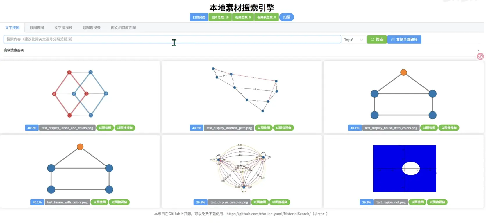

## 功能介绍

- 文字搜图
- 以图搜图
- 文字搜视频（会给出符合描述的视频片段）
- 以图搜视频（通过视频截图搜索所在片段）
- 路径搜图和路径搜视频（通过输入路径关键词，搜索路径里包含该关键词的素材，适合用户通过记忆的路径信息来快速定位素材）
- 图文相似度计算

这个软件实现了本地搜图和搜视频片段的功能，用户可以通过语言描述（语义）或者相似的图片来进行搜索。不仅适用于个人照片管理，还可以用于商品图片、设计素材、图案花纹等搜索。经过两年多的迭代开发，目前已经比较成熟稳定，现在的用户覆盖了个人用户、设计师、摄影师、视频剪辑师、内容创作者，以及建筑、贸易等行业的专业用户（真不是吹牛，用户群里就是各种行业的人都在用，用户范围比我想象的要广）。

最重要的是，这个软件完全免费开源，任何人都可以下载使用。而且只要遵循开源协议，就可以自由修改和分发。在当今AI技术的加持下，任何人都有能力进行二次开发和定制。

## AI语义搜索本地素材一键整合包官方下载

官方下载地址（选择一个下载即可）：

- [夸克网盘](https://pan.quark.cn/s/ae137c439484)
- [百度网盘](https://pan.baidu.com/s/1uQ8t-4mbYmcfi6FjwzdrrQ?pwd=CHNL) 提取码: CHNL
- [GitHub Release](https://github.com/chn-lee-yumi/MaterialSearch/releases/latest)

**本软件是开源软件，免费下载使用，不用付款购买，切勿上当受骗！**

官方开源代码仓库：[github.com/chn-lee-yumi/MaterialSearch](https://github.com/chn-lee-yumi/MaterialSearch)

核心功能模块单独建立了一个开源库，同时支持pip直接下载使用：[github.com/chn-lee-yumi/MaterialSearch-core](https://github.com/chn-lee-yumi/MaterialSearch-core)

## 整合包使用教程

下载`MaterialSearchWindows_include_base_model.7z`，下载完成后解压缩（注意：推荐使用 [7-Zip](https://www.7-zip.org/)，使用其它软件解压缩，可能遇到会报错，但一般不影响使用）。

解压缩完成后，进入解压缩后的文件夹，右键“.env”文件进行编辑，配置扫描路径和设备，然后保存。 

最后双击运行“run.bat”即可，待看到"http://127.0.0.1:8085"的输出就可以浏览器打开对应链接进行使用。

关闭“run.bat”的运行框即关闭程序。

<p></p>

## 一键整合包视频教程

<iframe src="//player.bilibili.com/player.html?isOutside=true&aid=116255386242108&bvid=BV1LXwyzkEMA&cid=36815046482&p=1" scrolling="no" border="0" frameborder="no" framespacing="0" allowfullscreen="true"></iframe>

## 遇到问题了怎么办？

请加用户互助QQ群：1029566498（因作者精力有限，欢迎加群讨论，互相帮助。一言解惑，胜造七级浮屠；一念善行，自有千般福报。）

群里都是大佬，人又善良，说话又好听，技术又好，还有各种使用技巧和二次开发的经验，欢迎加入一起交流学习！

也可以看看项目的[中文文档](https://github.com/chn-lee-yumi/MaterialSearch/blob/main/README_ZH.md)。

如果你觉得这个软件不错，欢迎在GitHub给个star，把这个项目推荐给需要的朋友，让更多人受益。

## NAS/Docker部署教程

本软件也支持在NAS或Docker环境中部署。

镜像地址：
- [yumilee/materialsearch](https://hub.docker.com/r/yumilee/materialsearch) (DockerHub)
- registry.cn-hongkong.aliyuncs.com/chn-lee-yumi/materialsearch (阿里云，推荐中国大陆用户使用)

启动镜像前，你需要准备：

1. 数据库的保存路径
2. 你的扫描路径以及打算挂载到容器内的哪个路径
3. 你可以通过修改`docker-compose.yml`里面的`environment`和`volumes`来进行配置。
4. 如果打算使用GPU，则需要取消注释`docker-compose.yml`里面的对应部分

具体请参考下面这份`docker-compose.yml`，已经写了详细注释：

```yaml
version: "3"

services:
  MaterialSearch:
    image: yumilee/materialsearch:latest # 托管在 DockerHub 的镜像，通过 GitHub Action 构建，支持amd64。
    # image: registry.cn-hongkong.aliyuncs.com/chn-lee-yumi/materialsearch:latest # 托管在阿里云的镜像，通过 GitHub Action 构建，支持amd64。如果 DockerHub 无法访问，可以使用这个镜像。
    restart: always # 容器重启规则设为always
    ports:
      - "8085:8085" # 映射容器的8085端口到宿主的8085端口（宿主端口:容器端口）
    environment: # 通过环境变量修改配置，注意下面填的路径是容器里面的路径，不是宿主的路径
      - ASSETS_PATH=/home,/mnt
      - SKIP_PATH=/tmp
      - HOST=0.0.0.0
      #- DEVICE=cuda
    volumes: # 将宿主的目录挂载到容器里（宿主路径:容器路径）
      - /srv/MaterialSearch/db:/MaterialSearch/instance/ # 挂载宿主/srv/MaterialSearch/db到容器的/MaterialSearch/instance/
      - /home:/home # 挂载宿主/home到容器的/home
      - /mnt:/mnt # 挂载宿主/mnt到容器的/mnt
    # 如果使用GPU，就取消注释下面的内容，并在上面environment处添加DEVICE=cuda
    #deploy:
    #  resources:
    #    reservations:
    #      devices:
    #        - driver: nvidia
    #          count: all
    #          capabilities: [ gpu ]
```

最后执行`docker-compose up -d`启动容器即可。如果你的NAS提供了图形化的Docker管理界面，也可以直接在界面上创建容器，配置和上面`docker-compose.yml`里的一样。

## 二次开发和定制说明

软件的核心代码是开源的，仓库地址：[github.com/chn-lee-yumi/MaterialSearch-core](https://github.com/chn-lee-yumi/MaterialSearch-core)

直接使用pip安装，就可以进行二次开发和调用：

```bash
pip install materialsearch-core
```

请注意遵守开源协议，尊重原作者的劳动成果，在进行二次开发和分发时，保留原作者的版权信息，并且注明修改内容和作者信息。这样可以促进开源社区的健康发展，也能让更多人受益于这个项目。

曾经整个项目都是开源的，后来发现有人直接盗窃我的成果，替换版权信息，然后以此来牟利。这些行为严重侵犯了我的合法权益，也违背了开源精神。就算违反了开源协议，维权成本也非常的高。开源协议就是一个君子协议，对小人无用。中国的开源环境真的太糟糕了。人在做，天在看，举头三尺有神明，善恶到头终有报。

所以我后来将核心功能模块单独建立了一个开源库，并且在整合包里使用这个库来实现核心功能。整合包不开源。这样既能保证核心功能的开源和免费使用，又能防止直接被恶意盗窃和滥用。虽然这种做法防君子不防小人，但是提高了一些违法成本。
